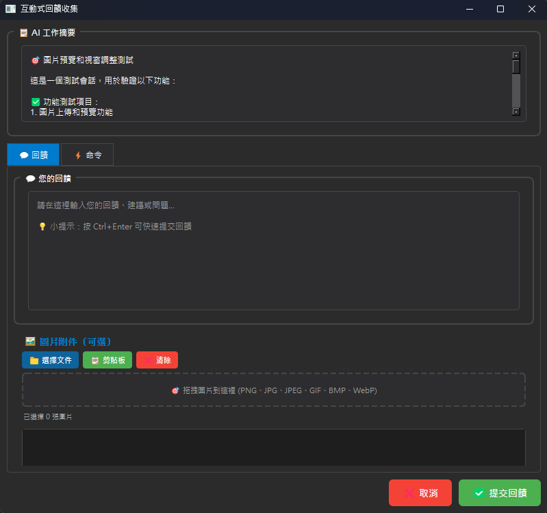
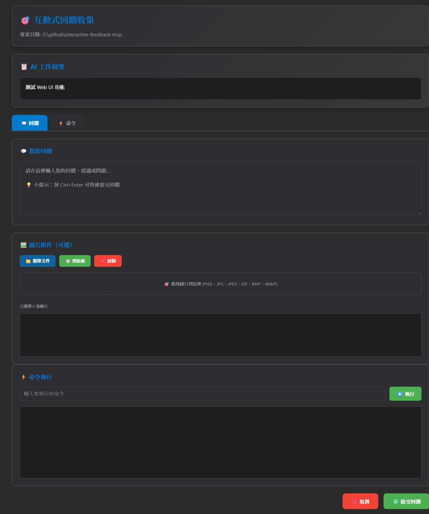

# Interactive Feedback MCP（互動回饋 MCP）

**原作者：** [Fábio Ferreira](https://x.com/fabiomlferreira)  
**分支版本：** [Minidoracat](https://github.com/Minidoracat)  
**UI 設計參考：** [sanshao85/mcp-feedback-collector](https://github.com/sanshao85/mcp-feedback-collector) - 感謝提供現代化界面設計靈感  
**相關資源：** [dotcursorrules.com](https://dotcursorrules.com/) 提供更多 AI 開發增強工具

這是一個簡單的 [MCP 伺服器](https://modelcontextprotocol.io/)，用於在 AI 輔助開發工具（如 [Cursor](https://www.cursor.com)）中實現人在回路（human-in-the-loop）的工作流程。該伺服器允許您執行命令、查看輸出並直接向 AI 提供文字回饋和圖片。同時支援 [Cline](https://cline.bot) 和 [Windsurf](https://windsurf.com)。

## ✨ 新功能特色

### 🌐 完整的 SSH Remote 支援
- **自動環境檢測**：智能檢測運行環境並選擇適當介面
- **本地環境**：使用原有的 Qt GUI 介面
- **SSH Remote 環境**：自動切換到現代化 Web UI
- **即時通訊**：基於 WebSocket 的即時命令輸出和回饋
- **深色主題**：提供現代化的深色主題界面

### 🖼️ 圖片上傳支援
- **多格式支援**：PNG、JPG、JPEG、GIF、BMP、WebP
- **拖拽上傳**：支援拖拽文件到介面
- **剪貼板支援**：直接從剪貼板粘貼圖片
- **自動壓縮**：智能壓縮大圖片以符合 1MB 限制
- **MCP 整合**：圖片自動轉換為 MCP Image 對象

### 🛡️ 穩定性改善
- **編碼修復**：完全解決中文字符亂碼問題
- **調試控制**：可控制的調試輸出，避免 JSON 解析錯誤
- **錯誤處理**：強化錯誤處理，確保程序穩定運行
- **輸出隔離**：嚴格隔離調試輸出與 MCP 通信

## 🖥️ 介面預覽

### Qt GUI 介面（本地環境）


### Web UI 介面（SSH Remote 環境）


兩種介面都支援：
- 💬 文字回饋輸入
- 🖼️ 圖片上傳（支援拖拽、剪貼板粘貼）
- ⚡ 即時命令執行
- 🎨 現代化深色主題
- 📱 響應式設計（Web UI）

## 🎯 為什麼使用這個工具？

透過引導 AI 助手與用戶進行確認，而非進行推測性的高成本工具調用，此模組可以大幅減少平台（如 Cursor）上的付費請求次數。在某些情況下，它可以將多達 25 次工具調用合併為單次回饋導向的請求，節省資源並提升效能。

## 📝 提示工程設定

為了獲得最佳效果，請在您的 AI 助手中添加以下自訂提示（例如在 Cursor 的規則或提示中）：

### 基本提示
> 每當你想要詢問問題時，請務必調用 MCP `mcp-feedback-enhanced`。  
> 每當你即將完成用戶請求時，請調用 MCP `mcp-feedback-enhanced` 而不是直接結束流程。  
> 持續調用 MCP 直到用戶的回饋為空，然後才結束請求。

### 完整規則範例
```
# MCP Interactive Feedback 規則

1. 在任何流程、任務、對話進行時，無論是詢問、回覆、或完成階段性任務，皆必須呼叫 MCP mcp-feedback-enhanced。
2. 每當收到使用者回饋，若回饋內容非空，必須再次呼叫 MCP mcp-feedback-enhanced，並根據回饋內容調整行為。
3. 僅當使用者明確表示「結束」或「不再需要互動」時，才可停止呼叫 MCP mcp-feedback-enhanced，流程才算結束。
4. 除非收到結束指令，否則所有步驟都必須重複呼叫 MCP mcp-feedback-enhanced。
```

這將確保您的 AI 助手在標記任務完成前使用此 MCP 伺服器請求用戶回饋。

## 🔧 環境檢測與配置

系統會自動檢測運行環境並選擇適當的介面：

### Qt GUI（本地環境）
- 使用 Qt 的 `QSettings` 按專案基礎儲存配置
- 包含命令設定、自動執行選項、視窗幾何狀態等
- 設定通常儲存在平台特定位置（Windows 登錄檔、macOS plist 檔案、Linux 配置目錄）

### Web UI（SSH Remote 環境）
- 基於 FastAPI 和 WebSocket 的現代化界面
- 支援即時命令執行和輸出顯示
- 自動瀏覽器啟動和會話管理
- 深色主題和響應式設計

### 調試模式控制
- **生產模式**：默認關閉所有調試輸出，確保與 MCP 客戶端完美兼容
- **調試模式**：設置 `MCP_DEBUG=true` 啟用詳細調試信息
- **輸出隔離**：所有調試信息輸出到 stderr，不干擾 MCP 通信

## 🚀 安裝說明

### 方法 1：uvx 安裝（推薦）

**這是最簡單的方法，無需手動管理依賴項或虛擬環境：**

1. **安裝 uv**（如果尚未安裝）
   ```bash
   # Windows
   pip install uv

   # Linux/Mac
   curl -LsSf https://astral.sh/uv/install.sh | sh
   ```

2. **測試安裝**
   ```bash
   # 查看版本信息（推薦使用 @latest 確保最新版本）
   uvx mcp-feedback-enhanced@latest version

   # 執行測試
   uvx mcp-feedback-enhanced@latest test

   # 持久化測試模式（可在瀏覽器中實際測試）
   uvx mcp-feedback-enhanced@latest test --persistent
   ```

### 方法 2：從源碼安裝（開發者）

適合需要修改代碼或貢獻開發的用戶：

1. **取得程式碼**
   ```bash
   git clone https://github.com/Minidoracat/mcp-feedback-enhanced.git
   cd mcp-feedback-enhanced
   ```

2. **安裝依賴項**
   ```bash
   uv sync
   ```

3. **測試安裝**
   ```bash
   # 基本功能測試
   uv run python -m mcp_feedback_enhanced test
   
   # 持久化測試模式（可在瀏覽器中實際測試）
   uv run python -m mcp_feedback_enhanced test --persistent
   ```

4. **運行 MCP 伺服器**
   ```bash
   uv run python -m mcp_feedback_enhanced
   ```

## ⚙️ AI 助手配置

### 推薦配置（使用 uvx）

在 Cursor 的設定中配置自訂 MCP 伺服器，或手動編輯 `mcp.json`：

```json
{
  "mcpServers": {
    "mcp-feedback-enhanced": {
      "command": "uvx",
      "args": [
        "mcp-feedback-enhanced@latest"
      ],
      "timeout": 600,
      "autoApprove": [
        "interactive_feedback"
      ]
    }
  }
}
```

### 替代配置（從源碼運行）

如果您需要使用源碼版本或想要自訂環境變數：

```json
{
  "mcpServers": {
    "mcp-feedback-enhanced": {
      "command": "uv",
      "args": [
        "--directory",
        "/path/to/mcp-feedback-enhanced",
        "run",
        "python",
        "-m",
        "mcp_feedback_enhanced"
      ],
      "timeout": 600,
      "env": {
        "FORCE_WEB": "true",
        "MCP_DEBUG": "false"
      },
      "autoApprove": [
        "interactive_feedback"
      ]
    }
  }
}
```

**記得將路徑修改為您實際的專案目錄！**

### Cline / Windsurf 配置

類似的設定原則：在各工具的 MCP 設定中配置伺服器命令，使用 `mcp-feedback-enhanced` 作為伺服器識別符。

## 🧪 測試和開發

### 使用 uvx 測試
```bash
# 完整功能測試（推薦）
uvx mcp-feedback-enhanced@latest test

# Qt GUI 專門測試
uvx mcp-feedback-enhanced@latest test --gui

# Web UI 專門測試
uvx mcp-feedback-enhanced@latest test --web

# 持久化測試模式（測試完不關閉，可互動測試）
uvx mcp-feedback-enhanced@latest test --persistent
uvx mcp-feedback-enhanced@latest test --gui --persistent
uvx mcp-feedback-enhanced@latest test --web --persistent

# 查看版本
uvx mcp-feedback-enhanced@latest version

# 啟用調試模式測試
MCP_DEBUG=true uvx mcp-feedback-enhanced@latest test
```

### 從源碼測試
```bash
# 完整功能測試
uv run python -m mcp_feedback_enhanced test

# Qt GUI 專門測試
uv run python -m mcp_feedback_enhanced test --gui

# Web UI 專門測試
uv run python -m mcp_feedback_enhanced test --web

# 持久化測試模式
uv run python -m mcp_feedback_enhanced test --persistent

# 啟用調試模式
MCP_DEBUG=true uv run python -m mcp_feedback_enhanced test
```

### 開發模式
使用 FastMCP 開發模式運行伺服器並開啟測試界面：
```bash
# 從源碼
uv run fastmcp dev src/mcp_feedback_enhanced/server.py
```

### 測試選項說明
- **無參數 `test`**：執行完整測試套件（環境檢測、參數驗證、MCP 整合、Web UI）
- **`--gui`**：專門測試 Qt GUI 功能和介面
- **`--web`**：專門測試 Web UI 功能和 WebSocket 通訊
- **`--persistent`**：持久化模式，測試完成後保持運行，方便互動測試

## 🌟 功能特色

### 🖥️ 雙介面支援
- **Qt GUI**：適用於本地開發環境，提供原生體驗
- **Web UI**：適用於 SSH remote 開發環境，現代化界面

### 🔍 智慧環境檢測
- 自動檢測 SSH 連線環境變數
- 檢測 DISPLAY 設定（Linux）
- 檢測 VSCode Remote 開發環境
- 自動選擇最適合的介面

### 💻 命令執行功能
- 即時命令執行和輸出顯示
- 支援命令中斷和程序樹終止
- 自動工作目錄設定
- 命令歷史記錄

### 🎨 現代化介面
- 深色主題設計
- 響應式佈局（支援手機瀏覽器）
- WebSocket 即時通訊
- 載入動畫和視覺回饋

### 🖼️ 圖片處理功能
- 支援多種圖片格式（PNG、JPG、JPEG、GIF、BMP、WebP）
- 智能文件大小檢測和壓縮
- 拖拽上傳和剪貼板支援
- 自動轉換為 MCP Image 對象
- Base64 編碼和預覽

## 🛠️ 環境變數配置

### 核心環境變數

| 環境變數 | 用途 | 可用值 | 默認值 |
|---------|------|--------|--------|
| `FORCE_WEB` | 強制使用 Web UI | `true`, `false`, `1`, `0`, `yes`, `no`, `on`, `off` | `false` |
| `MCP_DEBUG` | 啟用調試模式 | `true`, `false`, `1`, `0`, `yes`, `no`, `on`, `off` | `false` |
| `INCLUDE_BASE64_DETAIL` | 圖片回饋包含完整 Base64 | `true`, `false`, `1`, `0`, `yes`, `no`, `on`, `off` | `false` |

### 使用範例

**在 MCP 配置中設定**：
```json
"env": {
  "FORCE_WEB": "true",           // 強制使用 Web UI
  "MCP_DEBUG": "false",          // 關閉調試輸出（推薦生產環境）
  "INCLUDE_BASE64_DETAIL": "true" // 包含完整圖片 Base64 數據
}
```

**在命令行中設定**：
```bash
# 啟用調試模式測試
MCP_DEBUG=true uvx mcp-feedback-enhanced@latest test

# 強制使用 Web UI
FORCE_WEB=true uvx mcp-feedback-enhanced@latest test
```

## 📖 使用範例

### 1. **推薦 MCP 配置（uvx）**

使用 uvx 的簡潔配置：
```json
{
  "mcpServers": {
    "mcp-feedback-enhanced": {
      "command": "uvx",
      "args": [
        "mcp-feedback-enhanced@latest"
      ],
      "timeout": 600,
      "env": {
        "MCP_DEBUG": "false"
      },
      "autoApprove": [
        "interactive_feedback"
      ]
    }
  }
}
```

### 2. **自訂環境變數配置**

如需要自訂環境變數（例如強制使用 Web UI）：
```json
{
  "mcpServers": {
    "mcp-feedback-enhanced": {
      "command": "uv",
      "args": [
        "--directory",
        "/path/to/mcp-feedback-enhanced",
        "run",
        "python",
        "-m",
        "mcp_feedback_enhanced"
      ],
      "timeout": 600,
      "env": {
        "FORCE_WEB": "true",
        "MCP_DEBUG": "false",
        "INCLUDE_BASE64_DETAIL": "true"
      },
      "autoApprove": [
        "interactive_feedback"
      ]
    }
  }
}
```

### 3. **工具調用範例**

AI 助手會如此調用 `mcp-feedback-enhanced` 工具：

```xml
<use_mcp_tool>
  <server_name>mcp-feedback-enhanced</server_name>
  <tool_name>interactive_feedback</tool_name>
  <arguments>
    {
      "project_directory": "/path/to/your/project",
      "summary": "我已經實現了您請求的更改並重構了主模組。請查看結果並提供回饋。"
    }
  </arguments>
</use_mcp_tool>
```

## 🔄 工作流程

1. **AI 助手調用** - AI 完成任務後調用 `mcp-feedback-enhanced`
2. **環境檢測** - 系統自動檢測運行環境
3. **介面啟動** - 根據環境啟動 Qt GUI 或 Web UI
4. **用戶互動** - 用戶可以執行命令、查看輸出、提供文字回饋、上傳圖片
5. **回饋傳遞** - 用戶回饋（包括圖片）傳回給 AI 助手
6. **流程繼續** - AI 根據回饋繼續或結束任務

## 🆕 版本更新

### v2.0.3 - 穩定性改善
- 🛡️ **完全修復中文字符編碼問題**：支援完美的中文顯示
- 🔧 **解決 JSON 解析錯誤**：修復 MCP 客戶端的 "Unexpected token" 錯誤
- 🎛️ **可控調試模式**：透過 `MCP_DEBUG` 環境變數控制調試輸出
- 🖼️ **強化圖片支援**：改善圖片處理和 Base64 編碼
- 🚀 **輸出隔離**：嚴格分離調試輸出與 MCP 通信
- 📦 **套件優化**：改善 uvx 安裝體驗和依賴管理

### v2.0 - Web UI 支援
- ✅ 新增 Web UI 介面支援 SSH remote 開發
- ✅ 自動環境檢測和介面選擇
- ✅ WebSocket 即時通訊
- ✅ 現代化深色主題
- ✅ 響應式設計支援
- ✅ 持久化測試模式

### v1.0 - 基礎版本（原作者）
- ✅ Qt GUI 介面
- ✅ 命令執行功能
- ✅ MCP 協議支援
- ✅ 多平台支援

## 🐛 故障排除

### 常見問題

**Q: 出現 "Unexpected token 'D'" 錯誤**  
A: 這通常是調試輸出干擾造成的。確保在生產環境中設置 `MCP_DEBUG=false` 或不設置該環境變數。

**Q: 中文字符顯示為亂碼**  
A: 已在 v2.0.3 中完全修復。如果仍有問題，請更新到最新版本：`uvx mcp-feedback-enhanced@latest`

**Q: 圖片上傳失敗**  
A: 檢查圖片大小是否超過 1MB 限制，並確保格式為支援的類型（PNG、JPG、JPEG、GIF、BMP、WebP）。

**Q: Web UI 無法啟動**  
A: 確保防火牆允許本地端口訪問，或嘗試設置 `FORCE_WEB=true` 環境變數。

### 調試模式

如需詳細調試信息，請啟用調試模式：
```bash
# 設置調試環境變數
MCP_DEBUG=true uvx mcp-feedback-enhanced@latest test
```

## 🙏 致謝與聯繫

### 原作者
**Fábio Ferreira** - [X @fabiomlferreira](https://x.com/fabiomlferreira)  
如果您覺得 Interactive Feedback MCP 有用，最好的支持方式是關注原作者的 X 帳號。

### UI 設計靈感
**sanshao85** - [mcp-feedback-collector](https://github.com/sanshao85/mcp-feedback-collector)  
感謝提供現代化界面設計靈感，讓本專案的 UI 更加美觀和易用。

### 分支維護者
如有關於 Web UI 功能、圖片支援或其他問題，歡迎在 [GitHub Issues](https://github.com/Minidoracat/mcp-feedback-enhanced/issues) 中提出。

### 社群支援
加入我們的 Discord 社群獲得即時協助和討論：
**Discord 社群：** [https://discord.gg/Gur2V67](https://discord.gg/Gur2V67)  
有任何問題都可以到社群中尋求幫助！

### 相關資源
- [Model Context Protocol](https://modelcontextprotocol.io/) - MCP 官方文件

## 📄 授權條款

本專案採用 MIT 授權條款。詳見 [LICENSE](LICENSE) 檔案。

---

**🌟 歡迎 Star 此專案並分享給更多開發者！**