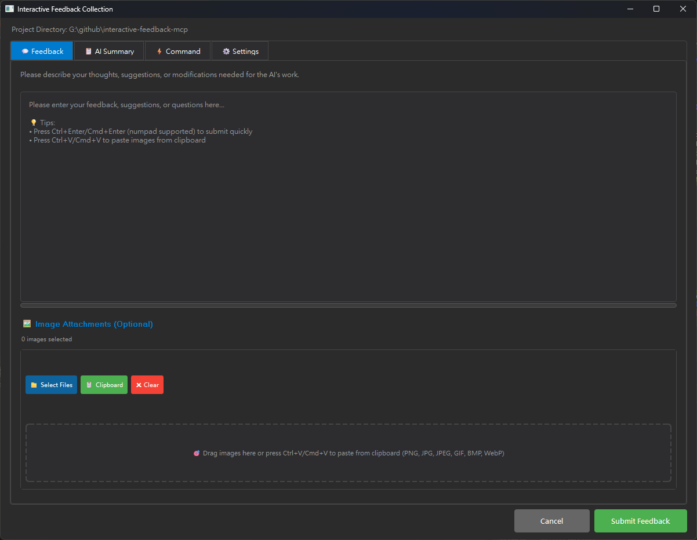
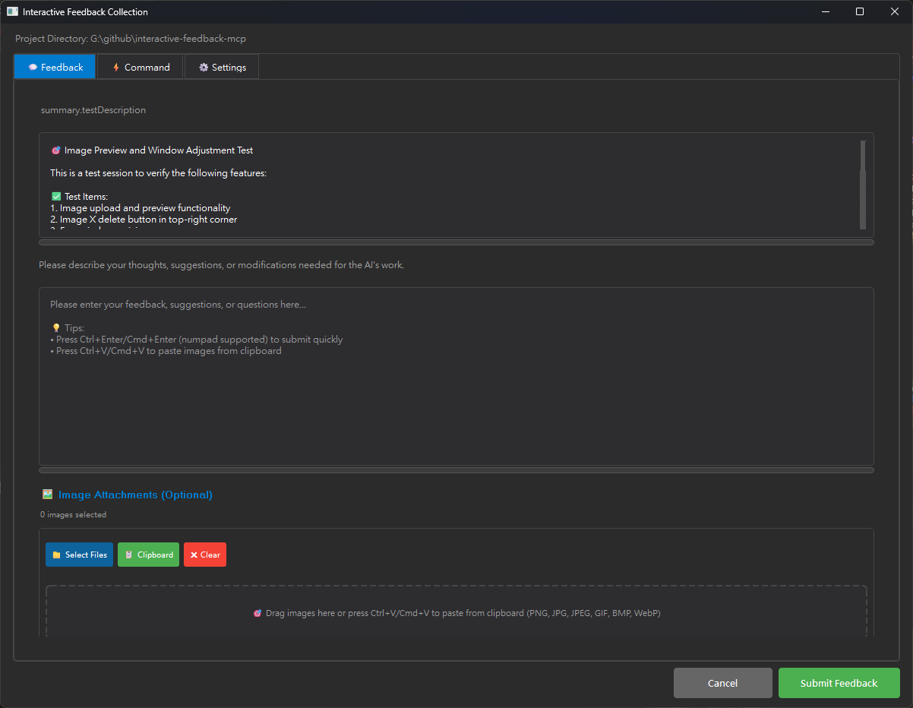
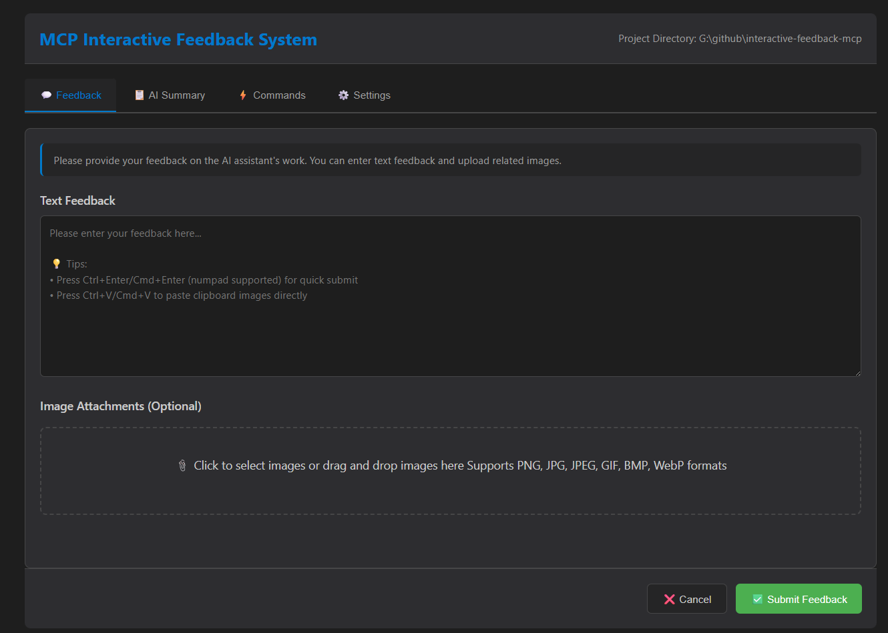
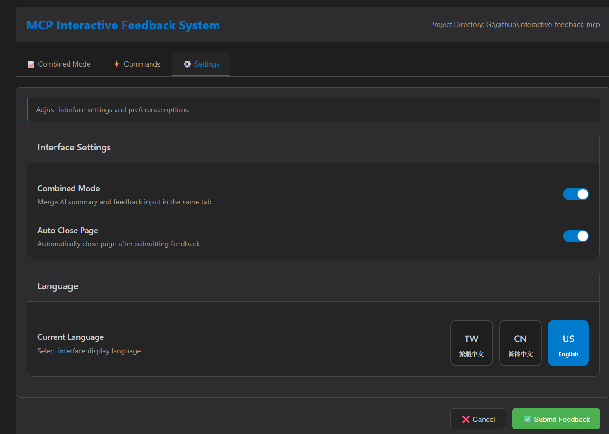

# Interactive Feedback MCP

**🌐 Language / 語言切換:** **English** | [繁體中文](README.zh-TW.md) | [简体中文](README.zh-CN.md)

**Original Author:** [Fábio Ferreira](https://x.com/fabiomlferreira) | [Original Project](https://github.com/noopstudios/interactive-feedback-mcp) ⭐  
**Enhanced Fork:** [Minidoracat](https://github.com/Minidoracat)  
**UI Design Reference:** [sanshao85/mcp-feedback-collector](https://github.com/sanshao85/mcp-feedback-collector)

## 🎯 Core Concept

This is an [MCP server](https://modelcontextprotocol.io/) that implements **human-in-the-loop** workflows in AI-assisted development tools. By guiding AI to confirm with users rather than making speculative operations, it can consolidate up to 25 tool calls into a single feedback-oriented request, dramatically reducing platform costs.

**Supported Platforms:** [Cursor](https://www.cursor.com) | [Cline](https://cline.bot) | [Windsurf](https://windsurf.com)

### 🔄 Workflow
1. **AI Call** → `mcp-feedback-enhanced`
2. **Environment Detection** → Auto-select appropriate interface
3. **User Interaction** → Command execution, text feedback, image upload
4. **Feedback Delivery** → Information returns to AI
5. **Process Continuation** → Adjust or end based on feedback

## 🌟 Key Features

### 🖥️ Dual Interface System
- **Qt GUI**: Native experience for local environments, modular refactored design
- **Web UI**: Modern interface for remote SSH environments, brand new architecture
- **Smart Switching**: Auto-detect environment and choose optimal interface

### 🎨 Brand New Interface Design (v2.1.0)
- **Modular Architecture**: Both GUI and Web UI adopt modular design
- **Centralized Management**: Reorganized folder structure for easier maintenance
- **Modern Themes**: Improved visual design and user experience
- **Responsive Layout**: Adapts to different screen sizes and window dimensions

### 🖼️ Image Support
- **Format Support**: PNG, JPG, JPEG, GIF, BMP, WebP
- **Upload Methods**: Drag & drop files + clipboard paste (Ctrl+V)
- **Auto Processing**: Smart compression to ensure 1MB limit compliance

### 🌏 Multi-language
- **Three Languages**: English, Traditional Chinese, Simplified Chinese
- **Smart Detection**: Auto-select based on system language
- **Live Switching**: Change language directly within interface

## 🖥️ Interface Preview

### Qt GUI Interface (Refactored Version)
<div align="center">
  
  
</div>

*Qt GUI Interface - Modular refactoring, supporting local environments*

### Web UI Interface (Refactored Version)
<div align="center">
  
  
</div>

*Web UI Interface - Brand new architecture, suitable for SSH Remote environments*

**Keyboard Shortcuts**
- `Ctrl+Enter`: Submit feedback (supports both main keyboard and numpad)
- `Ctrl+V`: Directly paste clipboard images

## 🚀 Quick Start

### 1. Installation & Testing
```bash
# Install uv (if not already installed)
pip install uv

# Quick test
uvx mcp-feedback-enhanced@latest test
```

### 2. MCP Configuration
**Basic Configuration** (suitable for most users):
```json
{
  "mcpServers": {
    "mcp-feedback-enhanced": {
      "command": "uvx",
      "args": ["mcp-feedback-enhanced@latest"],
      "timeout": 600,
      "autoApprove": ["interactive_feedback"]
    }
  }
}
```

**Advanced Configuration** (custom environment needed):
```json
{
  "mcpServers": {
    "mcp-feedback-enhanced": {
      "command": "uvx",
      "args": ["mcp-feedback-enhanced@latest"],
      "timeout": 600,
      "env": {
        "FORCE_WEB": "true",
        "MCP_DEBUG": "false"
      },
      "autoApprove": ["interactive_feedback"]
    }
  }
}
```

### 3. Prompt Engineering Setup
For best results, add these rules to your AI assistant:

```
# MCP Interactive Feedback Rules

1. During any process, task, or conversation, whether asking, responding, or completing stage tasks, must call MCP mcp-feedback-enhanced.
2. When receiving user feedback, if feedback content is not empty, must call MCP mcp-feedback-enhanced again and adjust behavior based on feedback.
3. Only when user explicitly indicates "end" or "no more interaction needed" can you stop calling MCP mcp-feedback-enhanced, then the process is complete.
4. Unless receiving end command, all steps must repeatedly call MCP mcp-feedback-enhanced.
```

## ⚙️ Advanced Settings

### Environment Variables
| Variable | Purpose | Values | Default |
|----------|---------|--------|---------|
| `FORCE_WEB` | Force use Web UI | `true`/`false` | `false` |
| `MCP_DEBUG` | Debug mode | `true`/`false` | `false` |
| `INCLUDE_BASE64_DETAIL` | Full Base64 for images | `true`/`false` | `false` |

### Testing Options
```bash
# Version check
uvx mcp-feedback-enhanced@latest version       # Check version

# Interface-specific testing
uvx mcp-feedback-enhanced@latest test --gui    # Quick test Qt GUI
uvx mcp-feedback-enhanced@latest test --web    # Test Web UI (auto continuous running)

# Debug mode
MCP_DEBUG=true uvx mcp-feedback-enhanced@latest test
```

### Developer Installation
```bash
git clone https://github.com/Minidoracat/mcp-feedback-enhanced.git
cd mcp-feedback-enhanced
uv sync
```

**Local Testing Methods**
```bash
# Method 1: Standard test (recommended)
uv run python -m mcp_feedback_enhanced test

# Method 2: Complete test suite (macOS and Windows dev environment)
uvx --with-editable . mcp-feedback-enhanced test

# Method 3: Interface-specific testing
uvx --with-editable . mcp-feedback-enhanced test --gui    # Quick test Qt GUI
uvx --with-editable . mcp-feedback-enhanced test --web    # Test Web UI (auto continuous running)
```

**Testing Descriptions**
- **Standard Test**: Complete functionality check, suitable for daily development verification
- **Complete Test**: Deep testing of all components, suitable for pre-release verification
- **Qt GUI Test**: Quick launch and test of local graphical interface
- **Web UI Test**: Start Web server and keep running for complete Web functionality testing

## 🆕 Version Highlights

### v2.2.1 (Window Optimization & Unified Settings Interface)
- 🖥️ **Window Size Constraint Removal**: Removed GUI main window minimum size limit from 1000×800 to 400×300, allowing users to freely adjust window size for different use cases (fixes [Issue #10](https://github.com/Minidoracat/mcp-feedback-enhanced/issues/10) part one).
- 💾 **Real-time Window State Saving**: Implemented real-time saving mechanism for window size and position changes, with debounce delay to avoid excessive I/O operations.
- ⚙️ **Unified Settings Interface Optimization**: Improved GUI settings page configuration saving logic to avoid setting conflicts, ensuring correct window positioning and size settings.
- 🎯 **Smart Window Size Saving**: In "Always center display" mode, correctly saves window size (but not position); in "Smart positioning" mode, saves complete window state.

### v2.2.0 (Layout & Settings UI Enhancements)
- ✨ **Enhanced Interface Layout**: Added a left-right layout (horizontal split) option for summary and feedback in the combined mode for both GUI and Web UI, offering more flexible viewing (fulfills [Issue #1](https://github.com/Minidoracat/mcp-feedback-enhanced/issues/1)).
- 🎨 **Improved Settings Interface**: Optimized the settings page for both GUI and Web UI, enhancing layout clarity and user experience.
- ⌨️ **GUI Shortcut Enhancement**: The submit feedback shortcut (Ctrl+Enter / Cmd+Enter) now fully supports the Enter key on the numeric keypad (numpad).
- 🐞 **Web UI Bug Fix**: Resolved an issue where pasting images using Ctrl+V in the text input area could lead to duplicate image pasting.

### v2.1.1 (Window Positioning Optimization)
- 🖥️ **Smart Window Positioning**: Added "Always show window at primary screen center" setting option
- 🌐 **Multi-Monitor Support**: Perfect solution for complex multi-monitor setups like T-shaped screen arrangements
- 💾 **Position Memory**: Auto-save and restore window position with intelligent visibility detection
- ⚙️ **User Choice**: Provides smart positioning (default) and forced center display modes

### v2.1.0 (Latest Refactored Version)
- 🎨 **Complete Refactoring**: GUI and Web UI adopt modular architecture
- 📁 **Centralized Management**: Reorganized folder structure, improved maintainability
- 🖥️ **Interface Optimization**: Modern design and improved user experience
- 🍎 **macOS Interface Optimization**: Specialized improvements for macOS user experience
- ⚙️ **Feature Enhancement**: New settings options and auto-close page functionality
- 🌐 **Language Switching**: Fixed Web UI content update issues when switching languages
- ℹ️ **About Page**: Added about page with version info, project links, and acknowledgments

### v2.0.14
- ⌨️ Enhanced Shortcuts: Ctrl+Enter supports numpad
- 🖼️ Smart Image Pasting: Ctrl+V directly pastes clipboard images

### v2.0.9
- 🌏 Multi-language architecture refactor with dynamic loading
- 📁 Modularized language file organization

### v2.0.3
- 🛡️ Complete fix for Chinese character encoding issues
- 🔧 Resolved JSON parsing errors

### v2.0.0
- ✅ Added Web UI support for remote environments
- ✅ Auto environment detection and interface selection
- ✅ WebSocket real-time communication

## 🐛 Common Issues

**Q: Getting "Unexpected token 'D'" error**  
A: Debug output interference. Set `MCP_DEBUG=false` or remove the environment variable.

**Q: Chinese character garbled text**  
A: Fixed in v2.0.3. Update to latest version: `uvx mcp-feedback-enhanced@latest`

**Q: Image upload fails**  
A: Check file size (≤1MB) and format (PNG/JPG/GIF/BMP/WebP).

**Q: Web UI won't start**  
A: Set `FORCE_WEB=true` or check firewall settings.

**Q: Gemini Pro 2.5 cannot parse images**  
A: Known issue. Gemini Pro 2.5 may not correctly parse uploaded image content. Testing shows Claude-4-Sonnet can properly analyze images. Recommend using Claude models for better image understanding capabilities.

**Q: Multi-screen window positioning issues**  
A: Fixed in v2.1.1. Go to "⚙️ Settings" tab, check "Always show window at primary screen center" to resolve window positioning issues. Especially useful for T-shaped screen arrangements and other complex multi-monitor configurations.

## 🙏 Acknowledgments

### 🌟 Support Original Author
**Fábio Ferreira** - [X @fabiomlferreira](https://x.com/fabiomlferreira)  
**Original Project:** [noopstudios/interactive-feedback-mcp](https://github.com/noopstudios/interactive-feedback-mcp)

If you find this useful, please:
- ⭐ [Star the original project](https://github.com/noopstudios/interactive-feedback-mcp)
- 📱 [Follow the original author](https://x.com/fabiomlferreira)

### Design Inspiration
**sanshao85** - [mcp-feedback-collector](https://github.com/sanshao85/mcp-feedback-collector)