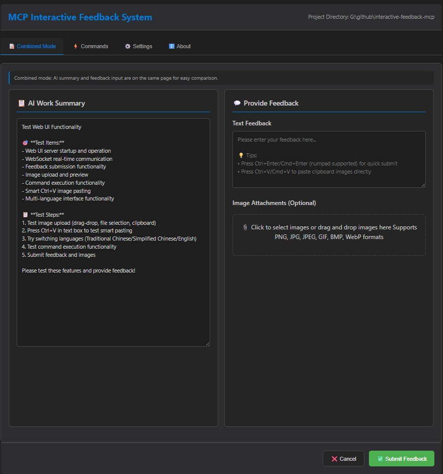

# MCP Feedback Enhanced

**🌐 Language / 語言切換:** **English** | [繁體中文](README.zh-TW.md) | [简体中文](README.zh-CN.md)

**Original Author:** [Fábio Ferreira](https://x.com/fabiomlferreira) | [Original Project](https://github.com/noopstudios/interactive-feedback-mcp) ⭐
**Enhanced Fork:** [Minidoracat](https://github.com/Minidoracat)
**UI Design Reference:** [sanshao85/mcp-feedback-collector](https://github.com/sanshao85/mcp-feedback-collector)

## 🎯 Core Concept

This is an [MCP server](https://modelcontextprotocol.io/) that establishes **feedback-oriented development workflows**, perfectly adapting to local, **SSH Remote environments** (Cursor SSH Remote, VS Code Remote SSH), and **WSL (Windows Subsystem for Linux) environments**. By guiding AI to confirm with users rather than making speculative operations, it can consolidate multiple tool calls into a single feedback-oriented request, dramatically reducing platform costs and improving development efficiency.

**Supported Platforms:** [Cursor](https://www.cursor.com) | [Cline](https://cline.bot) | [Windsurf](https://windsurf.com) | [Augment](https://www.augmentcode.com) | [Trae](https://www.trae.ai)

### 🔄 Workflow
1. **AI Call** → `mcp-feedback-enhanced`
2. **Environment Detection** → Auto-select appropriate interface
3. **User Interaction** → Command execution, text feedback, image upload
4. **Feedback Delivery** → Information returns to AI
5. **Process Continuation** → Adjust or end based on feedback

## 🌟 Key Features

### 🖥️ Dual Interface System
- **Qt GUI**: Native experience for local environments, modular refactored design
- **Web UI**: Modern interface for remote SSH and WSL environments, brand new architecture
- **Smart Switching**: Auto-detect environment (local/remote/WSL) and choose optimal interface

### 🎨 Brand New Interface Design (v2.1.0)
- **Modular Architecture**: Both GUI and Web UI adopt modular design
- **Centralized Management**: Reorganized folder structure for easier maintenance
- **Modern Themes**: Improved visual design and user experience
- **Responsive Layout**: Adapts to different screen sizes and window dimensions

### 🖼️ Image Support
- **Format Support**: PNG, JPG, JPEG, GIF, BMP, WebP
- **Upload Methods**: Drag & drop files + clipboard paste (Ctrl+V)
- **Auto Processing**: Smart compression to ensure 1MB limit compliance

### 🌏 Multi-language
- **Three Languages**: English, Traditional Chinese, Simplified Chinese
- **Smart Detection**: Auto-select based on system language
- **Live Switching**: Change language directly within interface

### ✨ WSL Environment Support (v2.2.5)
- **Auto Detection**: Intelligently identifies WSL (Windows Subsystem for Linux) environments
- **Browser Integration**: Automatically launches Windows browser in WSL environments
- **Multiple Launch Methods**: Supports `cmd.exe`, `powershell.exe`, `wslview` and other browser launch methods
- **Seamless Experience**: WSL users can directly use Web UI without additional configuration

### 🌐 SSH Remote Environment Support (v2.3.0 New Feature)
- **Smart Detection**: Automatically identifies SSH Remote environments (Cursor SSH Remote, VS Code Remote SSH, etc.)
- **Browser Launch Guidance**: Provides clear solutions when browser cannot launch automatically
- **Port Forwarding Support**: Complete port forwarding setup guidance and troubleshooting
- **MCP Integration Optimization**: Improved integration with MCP system for more stable connection experience
- **Detailed Documentation**: [SSH Remote Environment Usage Guide](docs/en/ssh-remote/browser-launch-issues.md)
- 🎯 **Auto-focus Input Box**: Automatically focus on feedback input box when window opens, improving user experience (Thanks @penn201500)
  
## 🖥️ Interface Preview

### Qt GUI Interface (Refactored Version)
<div align="center">
  
  
</div>

*Qt GUI Interface - Modular refactoring, supporting local environments*

### Web UI Interface (Refactored Version)
<div align="center">
  
  
</div>

*Web UI Interface - Brand new architecture, suitable for SSH Remote environments*

**Keyboard Shortcuts**
- `Ctrl+Enter` (Windows/Linux) / `Cmd+Enter` (macOS): Submit feedback (supports both main keyboard and numpad)
- `Ctrl+V` (Windows/Linux) / `Cmd+V` (macOS): Directly paste clipboard images

## 🚀 Quick Start

### 1. Installation & Testing
```bash
# Install uv (if not already installed)
pip install uv

# Quick test
uvx mcp-feedback-enhanced@latest test
```

### 2. MCP Configuration
**Basic Configuration** (suitable for most users):
```json
{
  "mcpServers": {
    "mcp-feedback-enhanced": {
      "command": "uvx",
      "args": ["mcp-feedback-enhanced@latest"],
      "timeout": 600,
      "autoApprove": ["interactive_feedback"]
    }
  }
}
```

**Advanced Configuration** (custom environment needed):
```json
{
  "mcpServers": {
    "mcp-feedback-enhanced": {
      "command": "uvx",
      "args": ["mcp-feedback-enhanced@latest"],
      "timeout": 600,
      "env": {
        "FORCE_WEB": "true",
        "MCP_DEBUG": "false"
      },
      "autoApprove": ["interactive_feedback"]
    }
  }
}
```

### 3. Prompt Engineering Setup
For best results, add these rules to your AI assistant:

```
# MCP Interactive Feedback Rules

1. During any process, task, or conversation, whether asking, responding, or completing stage tasks, must call MCP mcp-feedback-enhanced.
2. When receiving user feedback, if feedback content is not empty, must call MCP mcp-feedback-enhanced again and adjust behavior based on feedback.
3. Only when user explicitly indicates "end" or "no more interaction needed" can you stop calling MCP mcp-feedback-enhanced, then the process is complete.
4. Unless receiving end command, all steps must repeatedly call MCP mcp-feedback-enhanced.
5. Before completing the task, use the MCP mcp-feedback-enhanced to ask the user for feedback.
```

## ⚙️ Advanced Settings

### Environment Variables
| Variable | Purpose | Values | Default |
|----------|---------|--------|---------|
| `FORCE_WEB` | Force use Web UI | `true`/`false` | `false` |
| `MCP_DEBUG` | Debug mode | `true`/`false` | `false` |
| `MCP_WEB_PORT` | Web UI port | `1024-65535` | `8765` |

### Testing Options
```bash
# Version check
uvx mcp-feedback-enhanced@latest version       # Check version

# Interface-specific testing
uvx mcp-feedback-enhanced@latest test --gui    # Quick test Qt GUI
uvx mcp-feedback-enhanced@latest test --web    # Test Web UI (auto continuous running)

# Debug mode
MCP_DEBUG=true uvx mcp-feedback-enhanced@latest test
```

### Developer Installation
```bash
git clone https://github.com/Minidoracat/mcp-feedback-enhanced.git
cd mcp-feedback-enhanced
uv sync
```

**Local Testing Methods**
```bash
# Method 1: Standard test (recommended)
uv run python -m mcp_feedback_enhanced test

# Method 2: Complete test suite (macOS and Windows dev environment)
uvx --with-editable . mcp-feedback-enhanced test

# Method 3: Interface-specific testing
uvx --with-editable . mcp-feedback-enhanced test --gui    # Quick test Qt GUI
uvx --with-editable . mcp-feedback-enhanced test --web    # Test Web UI (auto continuous running)
```

**Testing Descriptions**
- **Standard Test**: Complete functionality check, suitable for daily development verification
- **Complete Test**: Deep testing of all components, suitable for pre-release verification
- **Qt GUI Test**: Quick launch and test of local graphical interface
- **Web UI Test**: Start Web server and keep running for complete Web functionality testing

## 🆕 Version History

📋 **Complete Version History:** [RELEASE_NOTES/CHANGELOG.en.md](RELEASE_NOTES/CHANGELOG.en.md)

### Latest Version Highlights (v2.3.0)
- 🌐 **SSH Remote Environment Support**: Solved Cursor SSH Remote browser launch issues with clear usage guidance
- 🛡️ **Error Message Improvements**: Provides more user-friendly error messages and solution suggestions when errors occur
- 🧹 **Auto-cleanup Features**: Automatically cleans temporary files and expired sessions to keep the system tidy
- 📊 **Memory Monitoring**: Monitors memory usage to prevent system resource shortage
- 🔧 **Connection Stability**: Improved Web UI connection stability and error handling

## 🐛 Common Issues

### 🌐 SSH Remote Environment Issues
**Q: Browser cannot launch in SSH Remote environment**
A: This is normal behavior. SSH Remote environments have no graphical interface, requiring manual opening in local browser. For detailed solutions, see: [SSH Remote Environment Usage Guide](docs/en/ssh-remote/browser-launch-issues.md)

**Q: Why am I not receiving new MCP feedback?**
A: There might be a WebSocket connection issue. **Solution**: Simply refresh the browser page.

**Q: Why isn't MCP being called?**
A: Please confirm the MCP tool status shows green light. **Solution**: Toggle the MCP tool on/off repeatedly, wait a few seconds for system reconnection.

**Q: Augment cannot start MCP**
A: **Solution**: Completely close and restart VS Code or Cursor, then reopen the project.

### 🔧 General Issues
**Q: Getting "Unexpected token 'D'" error**
A: Debug output interference. Set `MCP_DEBUG=false` or remove the environment variable.

**Q: Chinese character garbled text**
A: Fixed in v2.0.3. Update to latest version: `uvx mcp-feedback-enhanced@latest`

**Q: Multi-screen window disappearing or positioning errors**
A: Fixed in v2.1.1. Go to "⚙️ Settings" tab, check "Always show window at primary screen center" to resolve. Especially useful for T-shaped screen arrangements and other complex multi-monitor configurations.

**Q: Image upload fails**
A: Check file size (≤1MB) and format (PNG/JPG/GIF/BMP/WebP).

**Q: Web UI won't start**
A: Set `FORCE_WEB=true` or check firewall settings.

**Q: UV Cache taking up too much disk space**
A: Due to frequent use of `uvx` commands, cache may accumulate to tens of GB. Regular cleanup is recommended:
```bash
# Check cache size and detailed information
python scripts/cleanup_cache.py --size

# Preview cleanup content (without actually cleaning)
python scripts/cleanup_cache.py --dry-run

# Execute standard cleanup
python scripts/cleanup_cache.py --clean

# Force cleanup (attempts to close related processes, solves Windows file lock issues)
python scripts/cleanup_cache.py --force

# Or use uv command directly
uv cache clean
```
For detailed instructions, see: [Cache Management Guide](docs/en/cache-management.md)

**Q: AI models cannot parse images**
A: Various AI models (including Gemini Pro 2.5, Claude, etc.) may have instability in image parsing, sometimes correctly identifying and sometimes unable to parse uploaded image content. This is a known limitation of AI visual understanding technology. Recommendations:
1. Ensure good image quality (high contrast, clear text)
2. Try uploading multiple times, retries usually succeed
3. If parsing continues to fail, try adjusting image size or format

## 🙏 Acknowledgments

### 🌟 Support Original Author
**Fábio Ferreira** - [X @fabiomlferreira](https://x.com/fabiomlferreira)
**Original Project:** [noopstudios/interactive-feedback-mcp](https://github.com/noopstudios/interactive-feedback-mcp)

If you find this useful, please:
- ⭐ [Star the original project](https://github.com/noopstudios/interactive-feedback-mcp)
- 📱 [Follow the original author](https://x.com/fabiomlferreira)

### Design Inspiration
**sanshao85** - [mcp-feedback-collector](https://github.com/sanshao85/mcp-feedback-collector)

### Contributors
**penn201500** - [GitHub @penn201500](https://github.com/penn201500)
- 🎯 Auto-focus input box feature ([PR #39](https://github.com/Minidoracat/mcp-feedback-enhanced/pull/39))

### Community Support
- **Discord:** [https://discord.gg/Gur2V67](https://discord.gg/Gur2V67)
- **Issues:** [GitHub Issues](https://github.com/Minidoracat/mcp-feedback-enhanced/issues)

## 📄 License

MIT License - see [LICENSE](LICENSE) file for details

---
**🌟 Welcome to Star and share with more developers!**