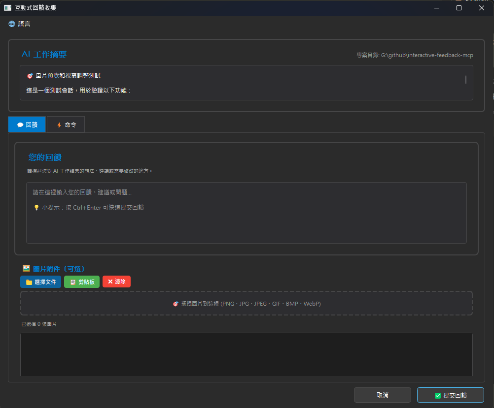
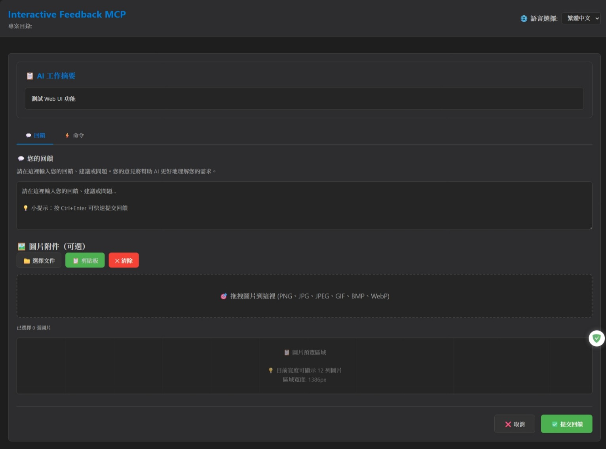

# Interactive Feedback MCP（互动回馈 MCP）

**🌐 语言切换 / Language:** [English](README.md) | [繁體中文](README.zh-TW.md) | **简体中文**

**原作者：** [Fábio Ferreira](https://x.com/fabiomlferreira) | [原始专案](https://github.com/noopstudios/interactive-feedback-mcp) ⭐  
**分支版本：** [Minidoracat](https://github.com/Minidoracat)  
**UI 设计参考：** [sanshao85/mcp-feedback-collector](https://github.com/sanshao85/mcp-feedback-collector)

## 🎯 核心概念

这是一个 [MCP 伺服器](https://modelcontextprotocol.io/)，在 AI 辅助开发工具中实现**人在回路（human-in-the-loop）**的工作流程。透过引导 AI 与用户确认而非进行推测性操作，可将多达 25 次工具调用合并为单次回馈导向请求，大幅节省平台成本。

**支援平台：** [Cursor](https://www.cursor.com) | [Cline](https://cline.bot) | [Windsurf](https://windsurf.com)

### 🔄 工作流程
1. **AI 调用** → `mcp-feedback-enhanced`
2. **环境检测** → 自动选择合适介面
3. **用户互动** → 命令执行、文字回馈、图片上传
4. **回馈传递** → 资讯返回 AI
5. **流程继续** → 根据回馈调整或结束

## 🌟 主要功能

### 🖥️ 双介面系统
- **Qt GUI**：本地环境原生体验
- **Web UI**：远端 SSH 环境现代化界面
- **智能切换**：自动检测环境并选择最适介面

### 🖼️ 图片支援
- **格式支援**：PNG、JPG、JPEG、GIF、BMP、WebP
- **上传方式**：拖拽档案 + 剪贴板粘贴（Ctrl+V）
- **自动处理**：智能压缩确保符合 1MB 限制

### 🌏 多语言
- **三语支援**：繁体中文、英文、简体中文
- **智能侦测**：根据系统语言自动选择
- **即时切换**：介面内可直接切换语言

## 🖥️ 介面预览

  
*Qt GUI 介面 - 本地环境*

  
*Web UI 介面 - SSH Remote 环境*

**快捷键支援**
- `Ctrl+Enter`：提交回馈（主键盘与数字键盘皆支援）
- `Ctrl+V`：直接粘贴剪贴板图片

## 🚀 快速开始

### 1. 安装与测试
```bash
# 安装 uv（如果尚未安装）
pip install uv

# 快速测试
uvx mcp-feedback-enhanced@latest test

# 可互动测试
uvx mcp-feedback-enhanced@latest test --persistent
```

### 2. 配置 MCP
**基本配置**（适合大多数用户）：
```json
{
  "mcpServers": {
    "mcp-feedback-enhanced": {
      "command": "uvx",
      "args": ["mcp-feedback-enhanced@latest"],
      "timeout": 600,
      "autoApprove": ["interactive_feedback"]
    }
  }
}
```

**进阶配置**（需要自订环境）：
```json
{
  "mcpServers": {
    "mcp-feedback-enhanced": {
      "command": "uvx",
      "args": ["mcp-feedback-enhanced@latest"],
      "timeout": 600,
      "env": {
        "FORCE_WEB": "true",
        "MCP_DEBUG": "false"
      },
      "autoApprove": ["interactive_feedback"]
    }
  }
}
```

### 3. 设定提示工程
为了获得最佳效果，请在 AI 助手中添加以下规则：

```
# MCP Interactive Feedback 规则

1. 在任何流程、任务、对话进行时，无论是询问、回复、或完成阶段性任务，皆必须呼叫 MCP mcp-feedback-enhanced。
2. 每当收到使用者回馈，若回馈内容非空，必须再次呼叫 MCP mcp-feedback-enhanced，并根据回馈内容调整行为。
3. 仅当使用者明确表示「结束」或「不再需要互动」时，才可停止呼叫 MCP mcp-feedback-enhanced，流程才算结束。
4. 除非收到结束指令，否则所有步骤都必须重复呼叫 MCP mcp-feedback-enhanced。
```

## ⚙️ 进阶设定

### 环境变数
| 变数 | 用途 | 值 | 默认 |
|------|------|-----|------|
| `FORCE_WEB` | 强制使用 Web UI | `true`/`false` | `false` |
| `MCP_DEBUG` | 调试模式 | `true`/`false` | `false` |
| `INCLUDE_BASE64_DETAIL` | 图片完整 Base64 | `true`/`false` | `false` |

### 测试选项
```bash
# 指定介面测试
uvx mcp-feedback-enhanced@latest test --gui    # 仅测试 Qt GUI
uvx mcp-feedback-enhanced@latest test --web    # 仅测试 Web UI

# 调试模式
MCP_DEBUG=true uvx mcp-feedback-enhanced@latest test
```

### 开发者安装
```bash
git clone https://github.com/Minidoracat/mcp-feedback-enhanced.git
cd mcp-feedback-enhanced
uv sync
uv run python -m mcp_feedback_enhanced test
```

## 🆕 版本亮点

### v2.0.14（最新）
- ⌨️ 增强快捷键：Ctrl+Enter 支援数字键盘
- 🖼️ 智能图片贴上：Ctrl+V 直接贴上剪贴板图片

### v2.0.9
- 🌏 多语言架构重构，支援动态载入
- 📁 语言档案模组化组织

### v2.0.3
- 🛡️ 完全修复中文字符编码问题
- 🔧 解决 JSON 解析错误

### v2.0.0
- ✅ 新增 Web UI 支援远端环境
- ✅ 自动环境检测与介面选择
- ✅ WebSocket 即时通讯

## 🐛 常见问题

**Q: 出现 "Unexpected token 'D'" 错误**  
A: 调试输出干扰。设置 `MCP_DEBUG=false` 或移除该环境变数。

**Q: 中文字符乱码**  
A: 已在 v2.0.3 修复。更新到最新版本：`uvx mcp-feedback-enhanced@latest`

**Q: 图片上传失败**  
A: 检查档案大小（≤1MB）和格式（PNG/JPG/GIF/BMP/WebP）。

**Q: Web UI 无法启动**  
A: 设置 `FORCE_WEB=true` 或检查防火墙设定。

## 🙏 致谢

### 🌟 支持原作者
**Fábio Ferreira** - [X @fabiomlferreira](https://x.com/fabiomlferreira)  
**原始专案：** [noopstudios/interactive-feedback-mcp](https://github.com/noopstudios/interactive-feedback-mcp)

如果您觉得有用，请：
- ⭐ [为原专案按星星](https://github.com/noopstudios/interactive-feedback-mcp)
- 📱 [关注原作者](https://x.com/fabiomlferreira)

### 设计灵感
**sanshao85** - [mcp-feedback-collector](https://github.com/sanshao85/mcp-feedback-collector)

### 社群支援
- **Discord：** [https://discord.gg/Gur2V67](https://discord.gg/Gur2V67)
- **Issues：** [GitHub Issues](https://github.com/Minidoracat/mcp-feedback-enhanced/issues)

## 📄 授权

MIT 授权条款 - 详见 [LICENSE](LICENSE) 档案

---
**🌟 欢迎 Star 并分享给更多开发者！**