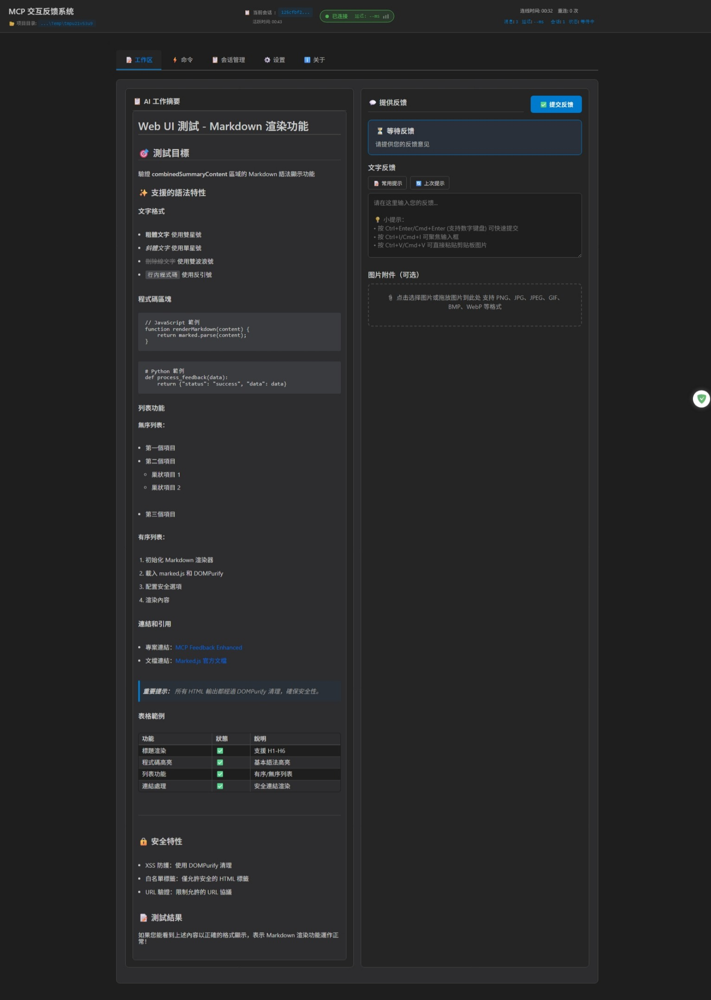

# MCP Feedback Enhanced（交互反馈 MCP）

**🌐 语言切换 / Language:** [English](README.md) | [繁體中文](README.zh-TW.md) | **简体中文**

**原作者：** [Fábio Ferreira](https://x.com/fabiomlferreira) | [原始项目](https://github.com/noopstudios/interactive-feedback-mcp) ⭐
**分支版本：** [Minidoracat](https://github.com/Minidoracat)
**UI 设计参考：** [sanshao85/mcp-feedback-collector](https://github.com/sanshao85/mcp-feedback-collector)

## 🎯 核心概念

这是一个 [MCP 服务器](https://modelcontextprotocol.io/)，建立**反馈导向的开发工作流程**，提供**Web UI 和桌面应用程序**双重选择，完美适配本地、**SSH Remote 环境**（Cursor SSH Remote、VS Code Remote SSH）与 **WSL (Windows Subsystem for Linux) 环境**。通过引导 AI 与用户确认而非进行推测性操作，可将多次工具调用合并为单次反馈导向请求，大幅节省平台成本并提升开发效率。

**🌐 双重界面架构优势：**
- 🖥️ **桌面应用程序**：原生跨平台桌面体验，支持 Windows、macOS、Linux
- 🌐 **Web UI 界面**：无需 GUI 依赖，适合远程和 WSL 环境
- 🔧 **灵活部署**：根据环境需求选择最适合的界面模式
- 📦 **统一功能**：两种界面提供完全相同的功能体验

**🖥️ 桌面应用程序：** v2.5.0 新增跨平台桌面应用程序支持，基于 Tauri 框架，支持 Windows、macOS、Linux 三大平台，提供原生桌面体验。

**支持平台：** [Cursor](https://www.cursor.com) | [Cline](https://cline.bot) | [Windsurf](https://windsurf.com) | [Augment](https://www.augmentcode.com) | [Trae](https://www.trae.ai)

### 🔄 工作流程
1. **AI 调用** → `mcp-feedback-enhanced` 工具
2. **界面启动** → 自动打开桌面应用程序或浏览器界面（根据配置）
3. **智能交互** → 提示词选择、文字输入、图片上传、自动提交
4. **即时反馈** → WebSocket 连接即时传递信息给 AI
5. **会话追踪** → 自动记录会话历史与统计
6. **流程继续** → AI 根据反馈调整行为或结束任务

## 🌟 主要功能

### 🖥️ 双重界面支持
- **桌面应用程序**：基于 Tauri 的跨平台原生应用，支持 Windows、macOS、Linux
- **Web UI 界面**：轻量级浏览器界面，适合远程和 WSL 环境
- **环境自动检测**：智能识别 SSH Remote、WSL 等特殊环境
- **统一功能体验**：两种界面提供完全相同的功能

### 📝 智能工作流程
- **提示词管理**：常用提示词的 CRUD 操作、使用统计、智能排序
- **自动定时提交**：1-86400 秒弹性计时器，支持暂停、恢复、取消
- **会话管理追踪**：本地文件存储、隐私控制、历史导出、即时统计
- **连接监控**：WebSocket 状态监控、自动重连、品质指示
- **AI 工作摘要 Markdown 显示**：支持丰富的 Markdown 语法渲染，包含标题、粗体、代码区块、列表、链接等格式，提升内容可读性

### 🎨 现代化体验
- **响应式设计**：适配不同屏幕尺寸，模块化 JavaScript 架构
- **音效通知**：内建多种音效、支持自定义音效上传、音量控制
- **智能记忆**：输入框高度记忆、一键复制、设定持久化
- **多语言支持**：简体中文、英文、繁体中文，即时切换

### 🖼️ 图片与媒体
- **全格式支持**：PNG、JPG、JPEG、GIF、BMP、WebP
- **便捷上传**：拖拽文件、剪贴板粘贴（Ctrl+V）
- **无限制处理**：支持任意大小图片，自动智能处理

## 🌐 界面预览

### Web UI 界面（v2.5.0 - 支持桌面应用程序）

<div align="center">
  
</div>

<details>
<summary>📱 点击查看完整界面截图</summary>

<div align="center">
  
</div>

</details>

*Web UI 界面 - 支持桌面应用程序和 Web 界面，提供提示词管理、自动提交、会话追踪等智能功能*

### 桌面应用程序界面（v2.5.0 新功能）

<div align="center">
  
</div>

*桌面应用程序 - 基于 Tauri 框架的原生跨平台桌面应用，支持 Windows、macOS、Linux，提供与 Web UI 完全相同的功能*

**快捷键支持**
- `Ctrl+Enter`（Windows/Linux）/ `Cmd+Enter`（macOS）：提交反馈（主键盘与数字键盘皆支持）
- `Ctrl+V`（Windows/Linux）/ `Cmd+V`（macOS）：直接粘贴剪贴板图片
- `Ctrl+I`（Windows/Linux）/ `Cmd+I`（macOS）：快速聚焦输入框 (感谢 @penn201500)

## 🚀 快速开始

### 1. 安装与测试
```bash
# 安装 uv（如果尚未安装）
pip install uv

# 快速测试
uvx mcp-feedback-enhanced@latest test
```

### 2. 配置 MCP
**基本配置**（适合大多数用户）：
```json
{
  "mcpServers": {
    "mcp-feedback-enhanced": {
      "command": "uvx",
      "args": ["mcp-feedback-enhanced@latest"],
      "timeout": 600,
      "autoApprove": ["interactive_feedback"]
    }
  }
}
```

**进阶配置**（需要自定义环境）：
```json
{
  "mcpServers": {
    "mcp-feedback-enhanced": {
      "command": "uvx",
      "args": ["mcp-feedback-enhanced@latest"],
      "timeout": 600,
      "env": {
        "MCP_DEBUG": "false",
        "MCP_WEB_PORT": "8765"
      },
      "autoApprove": ["interactive_feedback"]
    }
  }
}
```

**桌面应用程序配置**（v2.5.0 新功能 - 使用原生桌面应用程序）：
```json
{
  "mcpServers": {
    "mcp-feedback-enhanced": {
      "command": "uvx",
      "args": ["mcp-feedback-enhanced@latest"],
      "timeout": 600,
      "env": {
        "MCP_DESKTOP_MODE": "true",
        "MCP_WEB_PORT": "8765",
        "MCP_DEBUG": "false"
      },
      "autoApprove": ["interactive_feedback"]
    }
  }
}
```

**配置文件示例**：
- 桌面模式：[examples/mcp-config-desktop.json](examples/mcp-config-desktop.json)
- Web 模式：[examples/mcp-config-web.json](examples/mcp-config-web.json)

### 3. 设定提示工程
为了获得最佳效果，请在 AI 助手中添加以下规则：

```
# MCP Interactive Feedback 规则

1. 在任何流程、任务、对话进行时，无论是询问、回复、或完成阶段性任务，皆必须调用 MCP mcp-feedback-enhanced。
2. 每当收到用户反馈，若反馈内容非空，必须再次调用 MCP mcp-feedback-enhanced，并根据反馈内容调整行为。
3. 仅当用户明确表示「结束」或「不再需要交互」时，才可停止调用 MCP mcp-feedback-enhanced，流程才算结束。
4. 除非收到结束指令，否则所有步骤都必须重复调用 MCP mcp-feedback-enhanced。
5. 完成任务前，必须使用 MCP mcp-feedback-enhanced 工具向用户询问反馈。
```

## ⚙️ 进阶设定

### 环境变量
| 变量 | 用途 | 值 | 默认 |
|------|------|-----|------|
| `MCP_DEBUG` | 调试模式 | `true`/`false` | `false` |
| `MCP_WEB_PORT` | Web UI 端口 | `1024-65535` | `8765` |
| `MCP_DESKTOP_MODE` | 桌面应用程序模式 | `true`/`false` | `false` |

### 测试选项
```bash
# 版本查询
uvx mcp-feedback-enhanced@latest version       # 检查版本

# 界面测试
uvx mcp-feedback-enhanced@latest test --web    # 测试 Web UI (自动持续运行)
uvx mcp-feedback-enhanced@latest test --desktop # 测试桌面应用程序 (v2.5.0 新功能)

# 调试模式
MCP_DEBUG=true uvx mcp-feedback-enhanced@latest test
```

### 开发者安装
```bash
git clone https://github.com/Minidoracat/mcp-feedback-enhanced.git
cd mcp-feedback-enhanced
uv sync
```

**本地测试方式**
```bash
# 功能测试
make test-func                                           # 标准功能测试
make test-web                                            # Web UI 测试 (持续运行)
make test-desktop-func                                   # 桌面应用功能测试

# 或直接使用指令
uv run python -m mcp_feedback_enhanced test              # 标准功能测试
uvx --no-cache --with-editable . mcp-feedback-enhanced test --web   # Web UI 测试 (持续运行)
uvx --no-cache --with-editable . mcp-feedback-enhanced test --desktop # 桌面应用测试

# 桌面应用构建 (v2.5.0 新功能)
make build-desktop                                       # 构建桌面应用 (debug 模式)
make build-desktop-release                               # 构建桌面应用 (release 模式)
make test-desktop                                        # 测试桌面应用
make clean-desktop                                       # 清理桌面构建产物

# 单元测试
make test                                                # 运行所有单元测试
make test-fast                                          # 快速测试 (跳过慢速测试)
make test-cov                                           # 测试并生成覆盖率报告

# 代码质量检查
make check                                              # 完整代码质量检查
make quick-check                                        # 快速检查并自动修复
```

**测试说明**
- **功能测试**：测试 MCP 工具的完整功能流程
- **单元测试**：测试各个模块的独立功能
- **覆盖率测试**：生成 HTML 覆盖率报告到 `htmlcov/` 目录
- **质量检查**：包含 linting、格式化、类型检查

## 🆕 版本更新记录

📋 **完整版本更新记录：** [RELEASE_NOTES/CHANGELOG.zh-CN.md](RELEASE_NOTES/CHANGELOG.zh-CN.md)

### 最新版本亮点（v2.5.0）
- 🖥️ **桌面应用程序**: 全新跨平台桌面应用，支持 Windows、macOS、Linux
- 📋 **AI 工作摘要 Markdown 显示**: 支持 Markdown 语法渲染，包含标题、粗体、代码区块、列表、链接等格式
- ⚡ **性能大幅提升**: 引入防抖/节流机制，减少不必要的渲染和网络请求
- 📊 **会话历史存储改进**: 从 localStorage 改为服务器端本地文件存储
- 🌐 **网络连接稳定性**: 改进 WebSocket 重连机制，支持网络状态检测
- 🎨 **UI 渲染优化**: 优化会话管理、统计信息、状态指示器的渲染性能
- 🛠️ **构建流程优化**: 新增 Makefile 桌面应用构建命令和开发工具
- 📚 **文档完善**: 新增桌面应用构建指南和工作流程说明

## 🐛 常见问题

### 🌐 SSH Remote 环境问题
**Q: SSH Remote 环境下浏览器无法启动**
A: 这是正常现象。SSH Remote 环境没有图形界面，需要手动在本地浏览器打开。详细解决方案请参考：[SSH Remote 环境使用指南](docs/zh-CN/ssh-remote/browser-launch-issues.md)

**Q: 为什么没有接收到 MCP 新的反馈？**
A: 可能是 WebSocket 连接问题。**解决方法**：直接重新刷新浏览器页面。

**Q: 为什么没有调用出 MCP？**
A: 请确认 MCP 工具状态为绿灯。**解决方法**：反复开关 MCP 工具，等待几秒让系统重新连接。

**Q: Augment 无法启动 MCP**
A: **解决方法**：完全关闭并重新启动 VS Code 或 Cursor，重新打开项目。

### 🔧 一般问题
**Q: 如何使用桌面应用程序？**
A: v2.5.0 新增跨平台桌面应用程序支持。在 MCP 配置中设定 `"MCP_DESKTOP_MODE": "true"` 即可启用：
```json
{
  "mcpServers": {
    "mcp-feedback-enhanced": {
      "command": "uvx",
      "args": ["mcp-feedback-enhanced@latest"],
      "timeout": 600,
      "env": {
        "MCP_DESKTOP_MODE": "true",
        "MCP_WEB_PORT": "8765"
      },
      "autoApprove": ["interactive_feedback"]
    }
  }
}
```
**配置文件示例**：[examples/mcp-config-desktop.json](examples/mcp-config-desktop.json)

**Q: 如何使用旧版 PyQt6 GUI 界面？**
A: v2.4.0 版本已完全移除 PyQt6 GUI 依赖。如需使用旧版 GUI，请指定 v2.3.0 或更早版本：`uvx mcp-feedback-enhanced@2.3.0`
**注意**：旧版本不包含新功能（提示词管理、自动提交、会话管理、桌面应用程序等）。

**Q: 出现 "Unexpected token 'D'" 错误**
A: 调试输出干扰。设置 `MCP_DEBUG=false` 或移除该环境变量。

**Q: 中文字符乱码**
A: 已在 v2.0.3 修复。更新到最新版本：`uvx mcp-feedback-enhanced@latest`

**Q: 多屏幕环境下窗口消失或定位错误**
A: 已在 v2.1.1 修复。进入「⚙️ 设置」标签页，勾选「总是在主屏幕中心显示窗口」即可解决。特别适用于 T 字型屏幕排列等复杂多屏幕配置。

**Q: 图片上传失败**
A: 检查文件格式（PNG/JPG/JPEG/GIF/BMP/WebP）。系统支持任意大小的图片文件。

**Q: Web UI 无法启动**
A: 检查防火墙设置或尝试使用不同的端口。

**Q: UV Cache 占用过多磁盘空间**
A: 由于频繁使用 `uvx` 命令，cache 可能会累积到数十 GB。建议定期清理：
```bash
# 查看 cache 大小和详细信息
python scripts/cleanup_cache.py --size

# 预览清理内容（不实际清理）
python scripts/cleanup_cache.py --dry-run

# 执行标准清理
python scripts/cleanup_cache.py --clean

# 强制清理（会尝试关闭相关程序，解决 Windows 文件占用问题）
python scripts/cleanup_cache.py --force

# 或直接使用 uv 命令
uv cache clean
```
详细说明请参考：[Cache 管理指南](docs/zh-CN/cache-management.md)

**Q: AI 模型无法解析图片**
A: 各种 AI 模型（包括 Gemini Pro 2.5、Claude 等）在图片解析上可能存在不稳定性，表现为有时能正确识别、有时无法解析上传的图片内容。这是 AI 视觉理解技术的已知限制。建议：
1. 确保图片质量良好（高对比度、清晰文字）
2. 多尝试几次上传，通常重试可以成功
3. 如持续无法解析，可尝试调整图片大小或格式

## 🙏 致谢

### 🌟 支持原作者
**Fábio Ferreira** - [X @fabiomlferreira](https://x.com/fabiomlferreira)
**原始项目：** [noopstudios/interactive-feedback-mcp](https://github.com/noopstudios/interactive-feedback-mcp)

如果您觉得有用，请：
- ⭐ [为原项目按星星](https://github.com/noopstudios/interactive-feedback-mcp)
- 📱 [关注原作者](https://x.com/fabiomlferreira)

### 设计灵感
**sanshao85** - [mcp-feedback-collector](https://github.com/sanshao85/mcp-feedback-collector)

### 贡献者
**penn201500** - [GitHub @penn201500](https://github.com/penn201500)
- 🎯 自动聚焦输入框功能 ([PR #39](https://github.com/Minidoracat/mcp-feedback-enhanced/pull/39))

### 社群支援
- **Discord：** [https://discord.gg/Gur2V67](https://discord.gg/Gur2V67)
- **Issues：** [GitHub Issues](https://github.com/Minidoracat/mcp-feedback-enhanced/issues)

## 📄 授权

MIT 授权条款 - 详见 [LICENSE](LICENSE) 档案

---
**🌟 欢迎 Star 并分享给更多开发者！**
