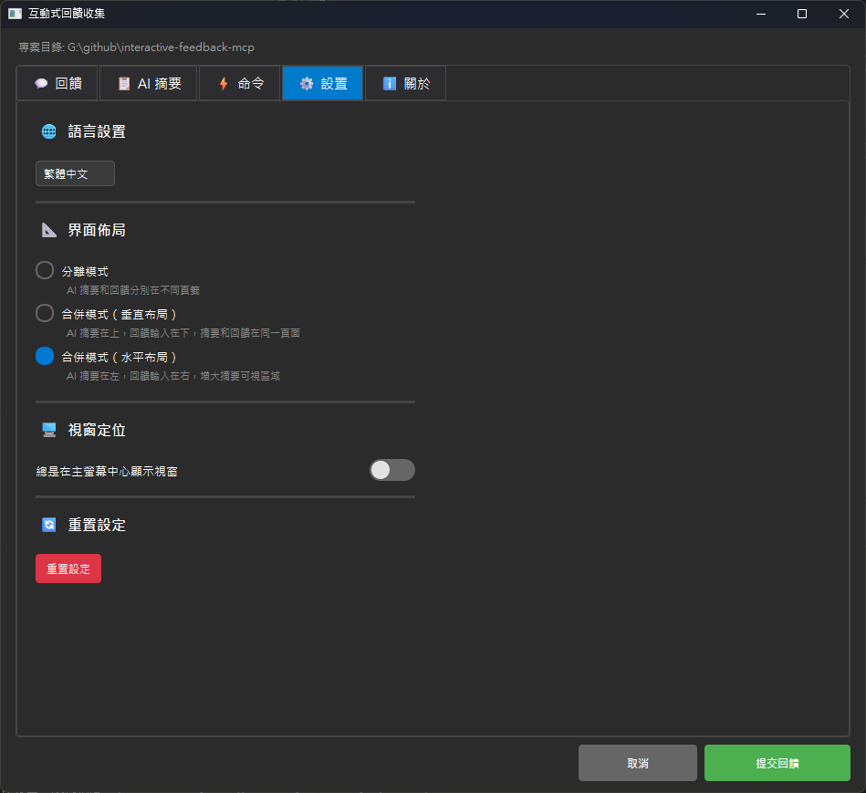

# MCP Feedback Enhanced（交互反馈 MCP）

**🌐 语言切换 / Language:** [English](README.md) | [繁體中文](README.zh-TW.md) | **简体中文**

**原作者：** [Fábio Ferreira](https://x.com/fabiomlferreira) | [原始项目](https://github.com/noopstudios/interactive-feedback-mcp) ⭐
**分支版本：** [Minidoracat](https://github.com/Minidoracat)
**UI 设计参考：** [sanshao85/mcp-feedback-collector](https://github.com/sanshao85/mcp-feedback-collector)

## 🎯 核心概念

这是一个 [MCP 服务器](https://modelcontextprotocol.io/)，建立**反馈导向的开发工作流程**，完美适配本地、**SSH Remote 环境**（Cursor SSH Remote、VS Code Remote SSH）与 **WSL (Windows Subsystem for Linux) 环境**。通过引导 AI 与用户确认而非进行推测性操作，可将多次工具调用合并为单次反馈导向请求，大幅节省平台成本并提升开发效率。

**支持平台：** [Cursor](https://www.cursor.com) | [Cline](https://cline.bot) | [Windsurf](https://windsurf.com) | [Augment](https://www.augmentcode.com) | [Trae](https://www.trae.ai)

### 🔄 工作流程
1. **AI 调用** → `mcp-feedback-enhanced`
2. **环境检测** → 自动选择合适界面
3. **用户交互** → 命令执行、文字反馈、图片上传
4. **反馈传递** → 信息返回 AI
5. **流程继续** → 根据反馈调整或结束

## 🌟 主要功能

### 🖥️ 双界面系统
- **Qt GUI**：本地环境原生体验，模块化重构设计
- **Web UI**：远程 SSH 环境与 WSL 环境现代化界面，全新架构
- **智能切换**：自动检测环境（本地/远程/WSL）并选择最适界面

### 🎨 全新界面设计（v2.1.0）
- **模块化架构**：GUI 和 Web UI 均采用模块化设计
- **集中管理**：文件夹结构重新组织，维护更容易
- **现代化主题**：改进的视觉设计和用户体验
- **响应式布局**：适应不同屏幕尺寸和窗口大小

### 🖼️ 图片支持
- **格式支持**：PNG、JPG、JPEG、GIF、BMP、WebP
- **上传方式**：拖拽文件 + 剪贴板粘贴（Ctrl+V）
- **自动处理**：智能压缩确保符合 1MB 限制

### 🌏 多语言
- **三语支持**：简体中文、英文、繁体中文
- **智能检测**：根据系统语言自动选择
- **即时切换**：界面内可直接切换语言

### ✨ WSL 环境支持（v2.2.5）
- **自动检测**：智能识别 WSL (Windows Subsystem for Linux) 环境
- **浏览器整合**：WSL 环境下自动启动 Windows 浏览器
- **多种启动方式**：支持 `cmd.exe`、`powershell.exe`、`wslview` 等多种浏览器启动方法
- **无缝体验**：WSL 用户可直接使用 Web UI，无需额外配置

### 🌐 SSH Remote 环境支持（v2.3.0 新功能）
- **智能检测**：自动识别 SSH Remote 环境（Cursor SSH Remote、VS Code Remote SSH 等）
- **浏览器启动指引**：当无法自动启动浏览器时，提供清晰的解决方案
- **端口转发支持**：完整的端口转发设置指引和故障排除
- **MCP 整合优化**：改善与 MCP 系统的整合，提供更稳定的连接体验
- **详细文档**：[SSH Remote 环境使用指南](docs/zh-CN/ssh-remote/browser-launch-issues.md)

## 🖥️ 界面预览

### Qt GUI 界面（重构版）
<div align="center">
  
  
</div>

*Qt GUI 界面 - 模块化重构，支持本地环境*

### Web UI 界面（重构版）
<div align="center">
  
  
</div>

*Web UI 界面 - 全新架构，适合 SSH Remote 环境*

**快捷键支持**
- `Ctrl+Enter`（Windows/Linux）/ `Cmd+Enter`（macOS）：提交反馈（主键盘与数字键盘皆支持）
- `Ctrl+V`（Windows/Linux）/ `Cmd+V`（macOS）：直接粘贴剪贴板图片

## 🚀 快速开始

### 1. 安装与测试
```bash
# 安装 uv（如果尚未安装）
pip install uv

# 快速测试
uvx mcp-feedback-enhanced@latest test
```

### 2. 配置 MCP
**基本配置**（适合大多数用户）：
```json
{
  "mcpServers": {
    "mcp-feedback-enhanced": {
      "command": "uvx",
      "args": ["mcp-feedback-enhanced@latest"],
      "timeout": 600,
      "autoApprove": ["interactive_feedback"]
    }
  }
}
```

**进阶配置**（需要自定义环境）：
```json
{
  "mcpServers": {
    "mcp-feedback-enhanced": {
      "command": "uvx",
      "args": ["mcp-feedback-enhanced@latest"],
      "timeout": 600,
      "env": {
        "FORCE_WEB": "true",
        "MCP_DEBUG": "false",
        "MCP_WEB_PORT": "8765"
      },
      "autoApprove": ["interactive_feedback"]
    }
  }
}
```

### 3. 设定提示工程
为了获得最佳效果，请在 AI 助手中添加以下规则：

```
# MCP Interactive Feedback 规则

1. 在任何流程、任务、对话进行时，无论是询问、回复、或完成阶段性任务，皆必须调用 MCP mcp-feedback-enhanced。
2. 每当收到用户反馈，若反馈内容非空，必须再次调用 MCP mcp-feedback-enhanced，并根据反馈内容调整行为。
3. 仅当用户明确表示「结束」或「不再需要交互」时，才可停止调用 MCP mcp-feedback-enhanced，流程才算结束。
4. 除非收到结束指令，否则所有步骤都必须重复调用 MCP mcp-feedback-enhanced。
5. 完成任务前，必须使用 MCP mcp-feedback-enhanced 工具向用户询问反馈。
```

## ⚙️ 进阶设定

### 环境变量
| 变量 | 用途 | 值 | 默认 |
|------|------|-----|------|
| `FORCE_WEB` | 强制使用 Web UI | `true`/`false` | `false` |
| `MCP_DEBUG` | 调试模式 | `true`/`false` | `false` |
| `MCP_WEB_PORT` | Web UI 端口 | `1024-65535` | `8765` |

### 测试选项
```bash
# 版本查询
uvx mcp-feedback-enhanced@latest version       # 检查版本

# 指定界面测试
uvx mcp-feedback-enhanced@latest test --gui    # 快速测试 Qt GUI
uvx mcp-feedback-enhanced@latest test --web    # 测试 Web UI (自动持续运行)

# 调试模式
MCP_DEBUG=true uvx mcp-feedback-enhanced@latest test
```

### 开发者安装
```bash
git clone https://github.com/Minidoracat/mcp-feedback-enhanced.git
cd mcp-feedback-enhanced
uv sync
```

**本地测试方式**
```bash
# 方式一：标准测试（推荐）
uv run python -m mcp_feedback_enhanced test

# 方式二：完整测试套件（macOS 和 Windows 通用开发环境）
uvx --with-editable . mcp-feedback-enhanced test

# 方式三：指定界面测试
uvx --with-editable . mcp-feedback-enhanced test --gui    # 快速测试 Qt GUI
uvx --with-editable . mcp-feedback-enhanced test --web    # 测试 Web UI (自动持续运行)
```

**测试说明**
- **标准测试**：执行完整的功能检查，适合日常开发验证
- **完整测试**：包含所有组件的深度测试，适合发布前验证
- **Qt GUI 测试**：快速启动并测试本地图形界面
- **Web UI 测试**：启动 Web 服务器并保持运行，便于完整测试 Web 功能

## 🆕 版本更新记录

📋 **完整版本更新记录：** [RELEASE_NOTES/CHANGELOG.zh-CN.md](RELEASE_NOTES/CHANGELOG.zh-CN.md)

### 最新版本亮点（v2.3.0）
- 🌐 **SSH Remote 环境支持**: 解决 Cursor SSH Remote 无法启动浏览器的问题，提供清晰的使用指引
- 🛡️ **错误提示改善**: 当发生错误时，提供更友善的错误信息和解决建议
- 🧹 **自动清理功能**: 自动清理临时文件和过期会话，保持系统整洁
- 📊 **内存监控**: 监控内存使用情况，防止系统资源不足
- 🔧 **连接稳定性**: 改善 Web UI 的连接稳定性和错误处理
- 🎯 **自动聚焦输入框**: 反馈窗口开启时自动聚焦到输入框，提升用户体验 (感谢 @penn201500)

## 🐛 常见问题

### 🌐 SSH Remote 环境问题
**Q: SSH Remote 环境下浏览器无法启动**
A: 这是正常现象。SSH Remote 环境没有图形界面，需要手动在本地浏览器打开。详细解决方案请参考：[SSH Remote 环境使用指南](docs/zh-CN/ssh-remote/browser-launch-issues.md)

**Q: 为什么没有接收到 MCP 新的反馈？**
A: 可能是 WebSocket 连接问题。**解决方法**：直接重新刷新浏览器页面。

**Q: 为什么没有调用出 MCP？**
A: 请确认 MCP 工具状态为绿灯。**解决方法**：反复开关 MCP 工具，等待几秒让系统重新连接。

**Q: Augment 无法启动 MCP**
A: **解决方法**：完全关闭并重新启动 VS Code 或 Cursor，重新打开项目。

### 🔧 一般问题
**Q: 出现 "Unexpected token 'D'" 错误**
A: 调试输出干扰。设置 `MCP_DEBUG=false` 或移除该环境变量。

**Q: 中文字符乱码**
A: 已在 v2.0.3 修复。更新到最新版本：`uvx mcp-feedback-enhanced@latest`

**Q: 多屏幕环境下窗口消失或定位错误**
A: 已在 v2.1.1 修复。进入「⚙️ 设置」标签页，勾选「总是在主屏幕中心显示窗口」即可解决。特别适用于 T 字型屏幕排列等复杂多屏幕配置。

**Q: 图片上传失败**
A: 检查文件大小（≤1MB）和格式（PNG/JPG/GIF/BMP/WebP）。

**Q: Web UI 无法启动**
A: 设置 `FORCE_WEB=true` 或检查防火墙设置。

**Q: UV Cache 占用过多磁盘空间**
A: 由于频繁使用 `uvx` 命令，cache 可能会累积到数十 GB。建议定期清理：
```bash
# 查看 cache 大小和详细信息
python scripts/cleanup_cache.py --size

# 预览清理内容（不实际清理）
python scripts/cleanup_cache.py --dry-run

# 执行标准清理
python scripts/cleanup_cache.py --clean

# 强制清理（会尝试关闭相关程序，解决 Windows 文件占用问题）
python scripts/cleanup_cache.py --force

# 或直接使用 uv 命令
uv cache clean
```
详细说明请参考：[Cache 管理指南](docs/zh-CN/cache-management.md)

**Q: AI 模型无法解析图片**
A: 各种 AI 模型（包括 Gemini Pro 2.5、Claude 等）在图片解析上可能存在不稳定性，表现为有时能正确识别、有时无法解析上传的图片内容。这是 AI 视觉理解技术的已知限制。建议：
1. 确保图片质量良好（高对比度、清晰文字）
2. 多尝试几次上传，通常重试可以成功
3. 如持续无法解析，可尝试调整图片大小或格式

## 🙏 致谢

### 🌟 支持原作者
**Fábio Ferreira** - [X @fabiomlferreira](https://x.com/fabiomlferreira)
**原始项目：** [noopstudios/interactive-feedback-mcp](https://github.com/noopstudios/interactive-feedback-mcp)

如果您觉得有用，请：
- ⭐ [为原项目按星星](https://github.com/noopstudios/interactive-feedback-mcp)
- 📱 [关注原作者](https://x.com/fabiomlferreira)

### 设计灵感
**sanshao85** - [mcp-feedback-collector](https://github.com/sanshao85/mcp-feedback-collector)

### 贡献者
**penn201500** - [GitHub @penn201500](https://github.com/penn201500)
- 🎯 自动聚焦输入框功能 ([PR #39](https://github.com/Minidoracat/mcp-feedback-enhanced/pull/39))

### 社群支援
- **Discord：** [https://discord.gg/Gur2V67](https://discord.gg/Gur2V67)
- **Issues：** [GitHub Issues](https://github.com/Minidoracat/mcp-feedback-enhanced/issues)

## 📄 授权

MIT 授权条款 - 详见 [LICENSE](LICENSE) 档案

---
**🌟 欢迎 Star 并分享给更多开发者！**