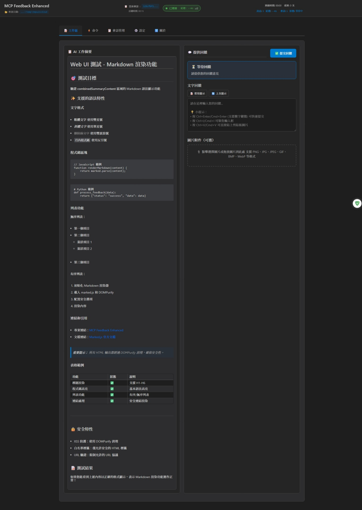

# MCP Feedback Enhanced（互動回饋 MCP）

**🌐 語言切換 / Language:** [English](README.md) | **繁體中文** | [简体中文](README.zh-CN.md)

**原作者：** [Fábio Ferreira](https://x.com/fabiomlferreira) | [原始專案](https://github.com/noopstudios/interactive-feedback-mcp) ⭐
**分支版本：** [Minidoracat](https://github.com/Minidoracat)
**UI 設計參考：** [sanshao85/mcp-feedback-collector](https://github.com/sanshao85/mcp-feedback-collector)

## 🎯 核心概念

這是一個 [MCP 伺服器](https://modelcontextprotocol.io/)，建立**回饋導向的開發工作流程**，採用**純 Web UI 架構**，完美適配本地、**SSH 遠端開發環境**與 **WSL (Windows Subsystem for Linux) 環境**。透過引導 AI 與用戶確認而非進行推測性操作，可將多次工具調用合併為單次回饋導向請求，大幅節省平台成本並提升開發效率。

**🌐 Web-Only 架構優勢：**
- 🚀 **簡化部署**：無需 GUI 依賴，安裝更輕量
- 🌍 **跨平台相容**：支援所有作業系統和環境
- 🔧 **維護簡單**：統一的 Web 介面，降低複雜度
- 📦 **體積精簡**：移除重型 GUI 庫，安裝包大幅縮小

**🔮 未來計劃：** 我們計劃在功能穩定後重新引入桌面版應用程式，目前專注於 Web UI 功能的完善和優化。

**支援平台：** [Cursor](https://www.cursor.com) | [Cline](https://cline.bot) | [Windsurf](https://windsurf.com) | [Augment](https://www.augmentcode.com) | [Trae](https://www.trae.ai)

### 🔄 工作流程
1. **AI 調用** → `mcp-feedback-enhanced` 工具
2. **Web UI 啟動** → 自動開啟瀏覽器介面（純 Web 架構）
3. **智能互動** → 提示詞選擇、文字輸入、圖片上傳、自動提交
4. **即時回饋** → WebSocket 連線即時傳遞資訊給 AI
5. **會話追蹤** → 自動記錄會話歷史與統計
6. **流程繼續** → AI 根據回饋調整行為或結束任務

## 🌟 主要功能

### 🌐 純 Web UI 架構系統
- **Web-Only 設計**：完全移除桌面 GUI 依賴，採用純 Web 介面
- **通用相容性**：支援本地、SSH Remote 和 WSL 環境
- **自動適配**：智能環境檢測與最佳配置
- **輕量部署**：無需複雜的 GUI 環境配置

### 📝 智能提示詞管理系統（v2.4.0 新功能）
- **CRUD 操作**：新增、編輯、刪除、使用常用提示詞
- **使用統計**：追蹤使用頻率並智能排序
- **快速應用**：一鍵選擇和應用提示詞
- **自動提交整合**：支援自動提交標記和優先顯示

### ⏰ 自動定時提交功能（v2.4.0 新功能）
- **彈性計時**：可設定 1-86400 秒的倒數計時器
- **視覺化顯示**：即時倒數顯示和狀態指示
- **深度整合**：與提示詞管理系統無縫配合
- **完整控制**：支援暫停、恢復、取消操作

### 📊 會話管理與追蹤（v2.4.3 重構增強）
- **獨立頁籤設計**：從左側邊欄遷移到專屬頁籤，解決瀏覽器相容性問題
- **本地歷史保存**：支援會話記錄本地保存，可設定保存期限
- **隱私控制**：用戶訊息記錄支援三種隱私等級設定
- **數據管理**：支援會話歷史匯出和清理功能
- **即時統計**：今日會話數量和平均時長統計

### 🔗 連線監控系統（v2.4.0 新功能）
- **即時監控**：WebSocket 連線狀態即時監控
- **品質指示**：延遲測量和連線品質指示
- **自動重連**：智能重連機制和錯誤處理
- **詳細統計**：完整的連線統計資訊

### 🔊 音效通知系統（v2.4.3 新功能）
- **智能提醒**：會話更新時自動播放音效通知
- **多種音效**：內建經典提示音、通知鈴聲、輕柔鐘聲
- **自訂音效**：支援上傳 MP3、WAV、OGG 格式的自訂音效
- **完整控制**：音量調節、測試播放、音效管理功能

### 🎨 現代化界面設計
- **模組化架構**：JavaScript 完全模組化重構
- **響應式設計**：適配不同螢幕尺寸和視窗大小
- **統一風格**：一致的設計語言和視覺體驗
- **智能佈局**：AI 摘要區域自動擴展，提交按鈕位置優化

### 🖼️ 圖片支援
- **格式支援**：PNG、JPG、JPEG、GIF、BMP、WebP
- **上傳方式**：拖拽檔案 + 剪貼板粘貼（Ctrl+V）
- **無限制上傳**：支援任意大小的圖片檔案，自動智能處理

### 💾 智能記憶功能（v2.4.3 新功能）
- **輸入框高度記憶**：自動保存和恢復文字輸入框的高度設定
- **一鍵複製**：專案路徑和會話ID支援點擊複製到剪貼板
- **設定持久化**：所有用戶偏好設定自動保存

### 🌏 多語言
- **三語支援**：繁體中文、英文、簡體中文
- **智能偵測**：根據系統語言自動選擇
- **即時切換**：介面內可直接切換語言
- **完整國際化**：包含 tooltip 和按鈕提示的多語言支援

### ✨ WSL 環境支援（v2.2.5）
- **自動檢測**：智能識別 WSL (Windows Subsystem for Linux) 環境
- **瀏覽器整合**：WSL 環境下自動啟動 Windows 瀏覽器
- **多種啟動方式**：支援 `cmd.exe`、`powershell.exe`、`wslview` 等多種瀏覽器啟動方法
- **無縫體驗**：WSL 用戶可直接使用 Web UI，無需額外配置

### 🌐 SSH Remote 環境支援（v2.3.0 新功能）
- **智能檢測**：自動識別 SSH Remote 環境（Cursor SSH Remote、VS Code Remote SSH 等）
- **瀏覽器啟動指引**：當無法自動啟動瀏覽器時，提供清晰的解決方案
- **端口轉發支援**：完整的端口轉發設定指引和故障排除
- **MCP 整合優化**：改善與 MCP 系統的整合，提供更穩定的連接體驗
- **詳細文檔**：[SSH Remote 環境使用指南](docs/zh-TW/ssh-remote/browser-launch-issues.md)

## 🌐 介面預覽

### Web UI 介面（v2.4.0 - Web-Only 架構）

<div align="center">
  
</div>

<details>
<summary>📱 點擊查看完整介面截圖</summary>

<div align="center">
  
</div>

</details>

*Web UI 介面 - 純 Web 架構，支援提示詞管理、自動提交、會話追蹤等智能功能*

**快捷鍵支援**
- `Ctrl+Enter`（Windows/Linux）/ `Cmd+Enter`（macOS）：提交回饋（主鍵盤與數字鍵盤皆支援）
- `Ctrl+V`（Windows/Linux）/ `Cmd+V`（macOS）：直接粘貼剪貼板圖片
- `Ctrl+I`（Windows/Linux）/ `Cmd+I`（macOS）：快速聚焦輸入框 (感謝 @penn201500)

## 🚀 快速開始

### 1. 安裝與測試
```bash
# 安裝 uv（如果尚未安裝）
pip install uv

# 快速測試
uvx mcp-feedback-enhanced@latest test
```

### 2. 配置 MCP
**基本配置**（適合大多數用戶）：
```json
{
  "mcpServers": {
    "mcp-feedback-enhanced": {
      "command": "uvx",
      "args": ["mcp-feedback-enhanced@latest"],
      "timeout": 600,
      "autoApprove": ["interactive_feedback"]
    }
  }
}
```

**進階配置**（需要自訂環境）：
```json
{
  "mcpServers": {
    "mcp-feedback-enhanced": {
      "command": "uvx",
      "args": ["mcp-feedback-enhanced@latest"],
      "timeout": 600,
      "env": {
        "MCP_DEBUG": "false",
        "MCP_WEB_PORT": "8765"
      },
      "autoApprove": ["interactive_feedback"]
    }
  }
}
```

### 3. 設定提示工程
為了獲得最佳效果，請在 AI 助手中添加以下規則：

```
# MCP Interactive Feedback 規則

1. 在任何流程、任務、對話進行時，無論是詢問、回覆、或完成階段性任務，皆必須呼叫 MCP mcp-feedback-enhanced。
2. 每當收到使用者回饋，若回饋內容非空，必須再次呼叫 MCP mcp-feedback-enhanced，並根據回饋內容調整行為。
3. 僅當使用者明確表示「結束」或「不再需要互動」時，才可停止呼叫 MCP mcp-feedback-enhanced，流程才算結束。
4. 除非收到結束指令，否則所有步驟都必須重複呼叫 MCP mcp-feedback-enhanced。
5. 完成任務前，必須使用 MCP mcp-feedback-enhanced 工具向使用者詢問回饋。
```

## ⚙️ 進階設定

### 環境變數
| 變數 | 用途 | 值 | 默認 |
|------|------|-----|------|
| `MCP_DEBUG` | 調試模式 | `true`/`false` | `false` |
| `MCP_WEB_PORT` | Web UI 端口 | `1024-65535` | `8765` |

### 測試選項
```bash
# 版本查詢
uvx mcp-feedback-enhanced@latest version       # 檢查版本

# 介面測試
uvx mcp-feedback-enhanced@latest test --web    # 測試 Web UI (自動持續運行)

# 調試模式
MCP_DEBUG=true uvx mcp-feedback-enhanced@latest test
```

### 開發者安裝
```bash
git clone https://github.com/Minidoracat/mcp-feedback-enhanced.git
cd mcp-feedback-enhanced
uv sync
```

**本地測試方式**
```bash
# 功能測試
uv run python -m mcp_feedback_enhanced test              # 標準功能測試
uvx --with-editable . mcp-feedback-enhanced test --web   # Web UI 測試 (持續運行)

# 單元測試
make test                                                # 運行所有單元測試
make test-fast                                          # 快速測試 (跳過慢速測試)
make test-cov                                           # 測試並生成覆蓋率報告

# 代碼品質檢查
make check                                              # 完整代碼品質檢查
make quick-check                                        # 快速檢查並自動修復
```

**測試說明**
- **功能測試**：測試 MCP 工具的完整功能流程
- **單元測試**：測試各個模組的獨立功能
- **覆蓋率測試**：生成 HTML 覆蓋率報告到 `htmlcov/` 目錄
- **品質檢查**：包含 linting、格式化、類型檢查


## 🆕 版本更新記錄

📋 **完整版本更新記錄：** [RELEASE_NOTES/CHANGELOG.zh-TW.md](RELEASE_NOTES/CHANGELOG.zh-TW.md)

### 最新版本亮點（v2.4.3）
- 📋 **會話管理重構**: 從左側邊欄遷移到獨立頁籤，解決瀏覽器相容性問題
- 🔊 **音效通知系統**: 會話更新音效提醒，支援內建和自訂音效
- 📚 **會話歷史增強**: 本地保存、隱私控制、匯出清理功能
- 💾 **智能記憶功能**: 輸入框高度記憶、一鍵複製等便利功能
- 🎨 **介面佈局優化**: AI 摘要自動擴展、按鈕位置調整、簡化設計
- 🌐 **多語言完善**: tooltip 和按鈕提示的完整國際化支援
- 🐛 **問題修復**: 修復會話詳情按鈕、彈窗關閉延遲等用戶體驗問題

## 🐛 常見問題

### 🌐 SSH Remote 環境問題
**Q: SSH Remote 環境下瀏覽器無法啟動**
A: 這是正常現象。SSH Remote 環境沒有圖形界面，需要手動在本地瀏覽器開啟。詳細解決方案請參考：[SSH Remote 環境使用指南](docs/zh-TW/ssh-remote/browser-launch-issues.md)

**Q: 為什麼沒有接收到 MCP 新的反饋？**
A: 可能是 WebSocket 連接問題。**解決方法**：直接重新整理瀏覽器頁面。

**Q: 為什麼沒有呼叫出 MCP？**
A: 請確認 MCP 工具狀態為綠燈。**解決方法**：反覆開關 MCP 工具，等待幾秒讓系統重新連接。

**Q: Augment 無法啟動 MCP**
A: **解決方法**：完全關閉並重新啟動 VS Code 或 Cursor，重新開啟專案。

### 🔧 一般問題
**Q: 如何使用舊版 GUI 介面？**
A: v2.4.0 版本已完全移除 PyQt6 GUI 依賴，轉為純 Web UI 架構。如需使用舊版 GUI，請指定 v2.3.0 或更早版本：
```bash
# 使用 v2.3.0（最後支援 GUI 的版本）
uvx mcp-feedback-enhanced@2.3.0

# 或在 MCP 配置中指定版本
{
  "mcpServers": {
    "mcp-feedback-enhanced": {
      "command": "uvx",
      "args": ["mcp-feedback-enhanced@2.3.0"],
      "timeout": 600,
      "autoApprove": ["interactive_feedback"]
    }
  }
}
```
**注意**：舊版本不包含 v2.4.0 的新功能（提示詞管理、自動提交、會話管理等）。

**Q: 出現 "Unexpected token 'D'" 錯誤**
A: 調試輸出干擾。設置 `MCP_DEBUG=false` 或移除該環境變數。

**Q: 中文字符亂碼**
A: 已在 v2.0.3 修復。更新到最新版本：`uvx mcp-feedback-enhanced@latest`

**Q: 多螢幕環境下視窗消失或定位錯誤**
A: 已在 v2.1.1 修復。進入「⚙️ 設定」分頁，勾選「總是在主螢幕中心顯示視窗」即可解決。特別適用於 T 字型螢幕排列等複雜多螢幕配置。

**Q: 圖片上傳失敗**
A: 檢查檔案格式（PNG/JPG/JPEG/GIF/BMP/WebP）。系統支援任意大小的圖片檔案。

**Q: Web UI 無法啟動**
A: 檢查防火牆設定或嘗試使用不同的端口。

**Q: UV Cache 佔用過多磁碟空間**
A: 由於頻繁使用 `uvx` 命令，cache 可能會累積到數十 GB。建議定期清理：
```bash
# 查看 cache 大小和詳細資訊
python scripts/cleanup_cache.py --size

# 預覽清理內容（不實際清理）
python scripts/cleanup_cache.py --dry-run

# 執行標準清理
python scripts/cleanup_cache.py --clean

# 強制清理（會嘗試關閉相關程序，解決 Windows 檔案佔用問題）
python scripts/cleanup_cache.py --force

# 或直接使用 uv 命令
uv cache clean
```
詳細說明請參考：[Cache 管理指南](docs/zh-TW/cache-management.md)

**Q: AI 模型無法解析圖片**
A: 各種 AI 模型（包括 Gemini Pro 2.5、Claude 等）在圖片解析上可能存在不穩定性，表現為有時能正確識別、有時無法解析上傳的圖片內容。這是 AI 視覺理解技術的已知限制。建議：
1. 確保圖片品質良好（高對比度、清晰文字）
2. 多嘗試幾次上傳，通常重試可以成功
3. 如持續無法解析，可嘗試調整圖片大小或格式

## 🙏 致謝

### 🌟 支持原作者
**Fábio Ferreira** - [X @fabiomlferreira](https://x.com/fabiomlferreira)
**原始專案：** [noopstudios/interactive-feedback-mcp](https://github.com/noopstudios/interactive-feedback-mcp)

如果您覺得有用，請：
- ⭐ [為原專案按星星](https://github.com/noopstudios/interactive-feedback-mcp)
- 📱 [關注原作者](https://x.com/fabiomlferreira)

### 設計靈感
**sanshao85** - [mcp-feedback-collector](https://github.com/sanshao85/mcp-feedback-collector)

### 貢獻者
**penn201500** - [GitHub @penn201500](https://github.com/penn201500)
- 🎯 自動聚焦輸入框功能 ([PR #39](https://github.com/Minidoracat/mcp-feedback-enhanced/pull/39))

### 社群支援
- **Discord：** [https://discord.gg/Gur2V67](https://discord.gg/Gur2V67)
- **Issues：** [GitHub Issues](https://github.com/Minidoracat/mcp-feedback-enhanced/issues)

## 📄 授權

MIT 授權條款 - 詳見 [LICENSE](LICENSE) 檔案

---
**🌟 歡迎 Star 並分享給更多開發者！**
