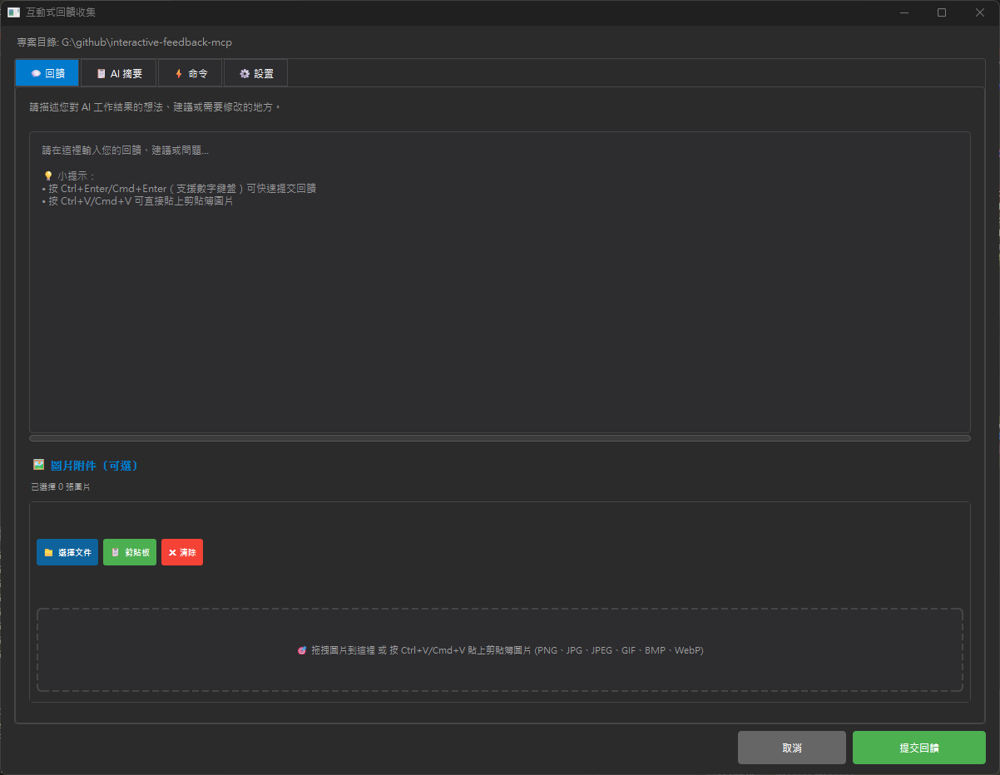
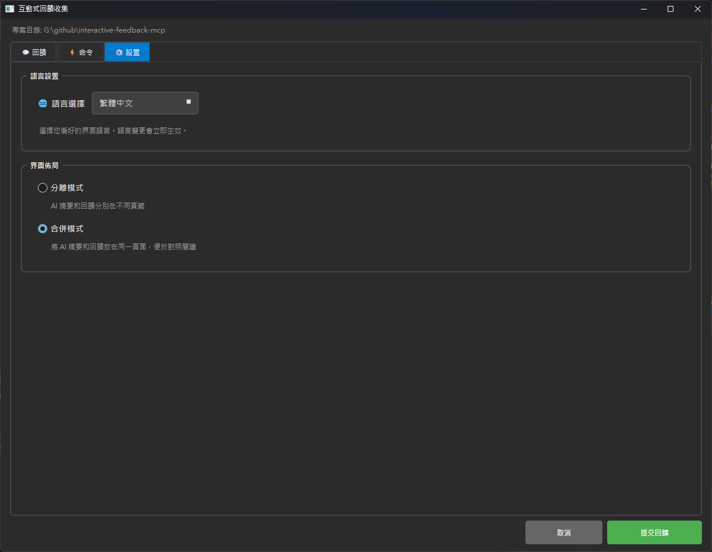
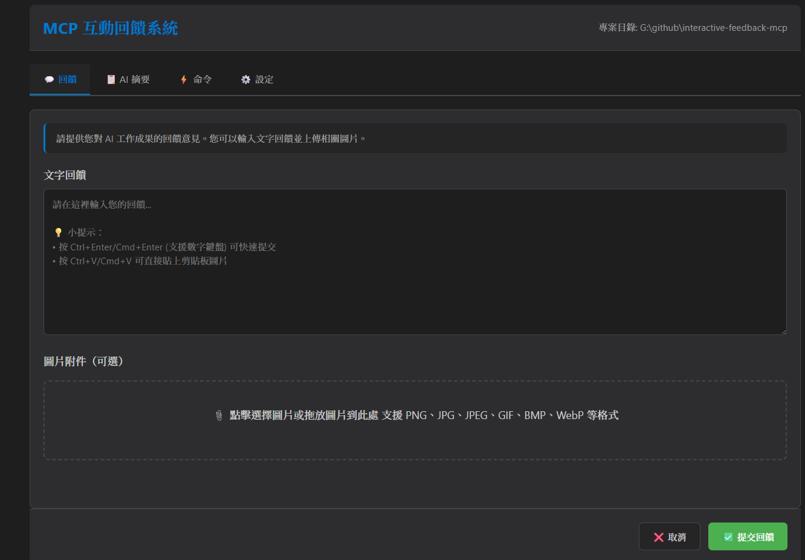
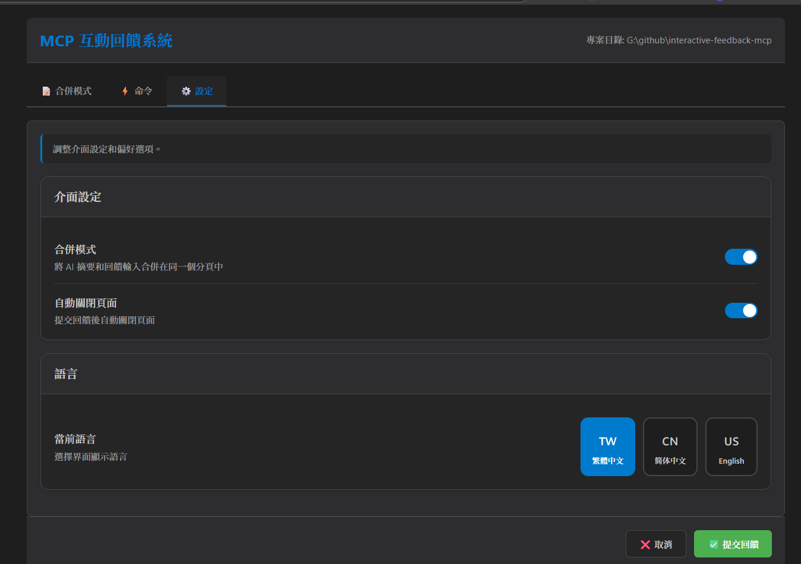

# Interactive Feedback MCP（互動回饋 MCP）

**🌐 語言切換 / Language:** [English](README.md) | **繁體中文** | [简体中文](README.zh-CN.md)

**原作者：** [Fábio Ferreira](https://x.com/fabiomlferreira) | [原始專案](https://github.com/noopstudios/interactive-feedback-mcp) ⭐  
**分支版本：** [Minidoracat](https://github.com/Minidoracat)  
**UI 設計參考：** [sanshao85/mcp-feedback-collector](https://github.com/sanshao85/mcp-feedback-collector)

## 🎯 核心概念

這是一個 [MCP 伺服器](https://modelcontextprotocol.io/)，在 AI 輔助開發工具中實現**人在回路（human-in-the-loop）**的工作流程。透過引導 AI 與用戶確認而非進行推測性操作，可將多達 25 次工具調用合併為單次回饋導向請求，大幅節省平台成本。

**支援平台：** [Cursor](https://www.cursor.com) | [Cline](https://cline.bot) | [Windsurf](https://windsurf.com)

### 🔄 工作流程
1. **AI 調用** → `mcp-feedback-enhanced`
2. **環境檢測** → 自動選擇合適介面
3. **用戶互動** → 命令執行、文字回饋、圖片上傳
4. **回饋傳遞** → 資訊返回 AI
5. **流程繼續** → 根據回饋調整或結束

## 🌟 主要功能

### 🖥️ 雙介面系統
- **Qt GUI**：本地環境原生體驗，模組化重構設計
- **Web UI**：遠端 SSH 環境現代化界面，全新架構
- **智能切換**：自動檢測環境並選擇最適介面

### 🎨 全新界面設計（v2.1.0）
- **模組化架構**：GUI 和 Web UI 均採用模組化設計
- **集中管理**：資料夾結構重新組織，維護更容易
- **現代化主題**：改進的視覺設計和用戶體驗
- **響應式布局**：適應不同螢幕尺寸和視窗大小

### 🖼️ 圖片支援
- **格式支援**：PNG、JPG、JPEG、GIF、BMP、WebP
- **上傳方式**：拖拽檔案 + 剪貼板粘貼（Ctrl+V）
- **自動處理**：智能壓縮確保符合 1MB 限制

### 🌏 多語言
- **三語支援**：繁體中文、英文、簡體中文
- **智能偵測**：根據系統語言自動選擇
- **即時切換**：介面內可直接切換語言

## 🖥️ 介面預覽

### Qt GUI 介面（重構版）
<div align="center">
  
  
</div>

*Qt GUI 介面 - 模組化重構，支援本地環境*

### Web UI 介面（重構版）
<div align="center">
  
  
</div>

*Web UI 介面 - 全新架構，適合 SSH Remote 環境*

**快捷鍵支援**
- `Ctrl+Enter`：提交回饋（主鍵盤與數字鍵盤皆支援）
- `Ctrl+V`：直接粘貼剪貼板圖片

## 🚀 快速開始

### 1. 安裝與測試
```bash
# 安裝 uv（如果尚未安裝）
pip install uv

# 快速測試
uvx mcp-feedback-enhanced@latest test
```

### 2. 配置 MCP
**基本配置**（適合大多數用戶）：
```json
{
  "mcpServers": {
    "mcp-feedback-enhanced": {
      "command": "uvx",
      "args": ["mcp-feedback-enhanced@latest"],
      "timeout": 600,
      "autoApprove": ["interactive_feedback"]
    }
  }
}
```

**進階配置**（需要自訂環境）：
```json
{
  "mcpServers": {
    "mcp-feedback-enhanced": {
      "command": "uvx",
      "args": ["mcp-feedback-enhanced@latest"],
      "timeout": 600,
      "env": {
        "FORCE_WEB": "true",
        "MCP_DEBUG": "false"
      },
      "autoApprove": ["interactive_feedback"]
    }
  }
}
```

### 3. 設定提示工程
為了獲得最佳效果，請在 AI 助手中添加以下規則：

```
# MCP Interactive Feedback 規則

1. 在任何流程、任務、對話進行時，無論是詢問、回覆、或完成階段性任務，皆必須呼叫 MCP mcp-feedback-enhanced。
2. 每當收到使用者回饋，若回饋內容非空，必須再次呼叫 MCP mcp-feedback-enhanced，並根據回饋內容調整行為。
3. 僅當使用者明確表示「結束」或「不再需要互動」時，才可停止呼叫 MCP mcp-feedback-enhanced，流程才算結束。
4. 除非收到結束指令，否則所有步驟都必須重複呼叫 MCP mcp-feedback-enhanced。
```

## ⚙️ 進階設定

### 環境變數
| 變數 | 用途 | 值 | 默認 |
|------|------|-----|------|
| `FORCE_WEB` | 強制使用 Web UI | `true`/`false` | `false` |
| `MCP_DEBUG` | 調試模式 | `true`/`false` | `false` |
| `INCLUDE_BASE64_DETAIL` | 圖片完整 Base64 | `true`/`false` | `false` |

### 測試選項
```bash
# 版本查詢
uvx mcp-feedback-enhanced@latest version       # 檢查版本

# 指定介面測試
uvx mcp-feedback-enhanced@latest test --gui    # 快速測試 Qt GUI
uvx mcp-feedback-enhanced@latest test --web    # 測試 Web UI (自動持續運行)

# 調試模式
MCP_DEBUG=true uvx mcp-feedback-enhanced@latest test
```

### 開發者安裝
```bash
git clone https://github.com/Minidoracat/mcp-feedback-enhanced.git
cd mcp-feedback-enhanced
uv sync
```

**本地測試方式**
```bash
# 方式一：標準測試（推薦）
uv run python -m mcp_feedback_enhanced test

# 方式二：完整測試套件（macOS 和 windows 通用開發環境）
uvx --with-editable . mcp-feedback-enhanced test

# 方式三：指定介面測試
uvx --with-editable . mcp-feedback-enhanced test --gui    # 快速測試 Qt GUI
uvx --with-editable . mcp-feedback-enhanced test --web    # 測試 Web UI (自動持續運行)
```

**測試說明**
- **標準測試**：執行完整的功能檢查，適合日常開發驗證
- **完整測試**：包含所有組件的深度測試，適合發布前驗證
- **Qt GUI 測試**：快速啟動並測試本地圖形界面
- **Web UI 測試**：啟動 Web 服務器並保持運行，便於完整測試 Web 功能

## 🆕 版本亮點

### v2.2.0 (佈局與設定界面優化)
- ✨ **界面佈局增強**：GUI 與 Web UI 的合併模式新增摘要與回饋的左右佈局（水平分割）選項，提供更靈活的檢視方式 (實現 [Issue #1](https://github.com/Minidoracat/mcp-feedback-enhanced/issues/1))。
- 🎨 **設定界面改進**：優化了 GUI 與 Web UI 的設定頁面，提升佈局清晰度與用戶操作體驗。
- ⌨️ **快捷鍵完善 (GUI)**：提交回饋快捷鍵 (Ctrl+Enter / Cmd+Enter) 現已完整支援數字鍵盤(九宮格)的 Enter 鍵。
- 🐞 **問題修復 (Web UI)**：解決了在文字輸入區使用 Ctrl+V 貼上圖片時，可能導致圖片重複貼上的問題。

### v2.1.1（視窗定位優化）
- 🖥️ **智能視窗定位**：新增「總是在主螢幕中心顯示視窗」設定選項
- 🌐 **多螢幕支援**：完美解決 T 字型螢幕排列等複雜多螢幕環境的視窗定位問題
- 💾 **位置記憶**：自動保存和恢復視窗位置，智能檢測視窗可見性
- ⚙️ **用戶選擇**：提供智能定位（預設）和強制中心顯示兩種模式

### v2.1.0（最新重構版）
- 🎨 **全面重構**：GUI 和 Web UI 採用模組化架構
- 📁 **集中管理**：重新組織資料夾結構，提升維護性
- 🖥️ **界面優化**：現代化設計和改進的用戶體驗
- 🍎 **macOS 介面優化**：針對 macOS 用戶體驗進行專項改進
- ⚙️ **功能增強**：新增設定選項和自動關閉頁面功能
- 🌐 **語言切換**：修復 Web UI 語言切換時內容更新問題
- ℹ️ **About 頁面**：新增關於頁面，包含版本資訊、專案連結和致謝內容

### v2.0.14
- ⌨️ 增強快捷鍵：Ctrl+Enter 支援數字鍵盤
- 🖼️ 智能圖片貼上：Ctrl+V 直接貼上剪貼板圖片

### v2.0.9
- 🌏 多語言架構重構，支援動態載入
- 📁 語言檔案模組化組織

### v2.0.3
- 🛡️ 完全修復中文字符編碼問題
- 🔧 解決 JSON 解析錯誤

### v2.0.0
- ✅ 新增 Web UI 支援遠端環境
- ✅ 自動環境檢測與介面選擇
- ✅ WebSocket 即時通訊

## 🐛 常見問題

**Q: 出現 "Unexpected token 'D'" 錯誤**  
A: 調試輸出干擾。設置 `MCP_DEBUG=false` 或移除該環境變數。

**Q: 中文字符亂碼**  
A: 已在 v2.0.3 修復。更新到最新版本：`uvx mcp-feedback-enhanced@latest`

**Q: 多螢幕環境下視窗消失或定位錯誤**  
A: 已在 v2.1.1 修復。進入「⚙️ 設定」分頁，勾選「總是在主螢幕中心顯示視窗」即可解決。特別適用於 T 字型螢幕排列等複雜多螢幕配置。

**Q: 圖片上傳失敗**  
A: 檢查檔案大小（≤1MB）和格式（PNG/JPG/GIF/BMP/WebP）。

**Q: Web UI 無法啟動**  
A: 設置 `FORCE_WEB=true` 或檢查防火牆設定。

**Q: AI 模型無法解析圖片**  
A: 各種 AI 模型（包括 Gemini Pro 2.5、Claude 等）在圖片解析上可能存在不穩定性，表現為有時能正確識別、有時無法解析上傳的圖片內容。這是 AI 視覺理解技術的已知限制。建議：
1. 確保圖片品質良好（高對比度、清晰文字）
2. 多嘗試幾次上傳，通常重試可以成功
3. 如持續無法解析，可嘗試調整圖片大小或格式

## 🙏 致謝

### 🌟 支持原作者
**Fábio Ferreira** - [X @fabiomlferreira](https://x.com/fabiomlferreira)  
**原始專案：** [noopstudios/interactive-feedback-mcp](https://github.com/noopstudios/interactive-feedback-mcp)

如果您覺得有用，請：
- ⭐ [為原專案按星星](https://github.com/noopstudios/interactive-feedback-mcp)
- 📱 [關注原作者](https://x.com/fabiomlferreira)

### 設計靈感
**sanshao85** - [mcp-feedback-collector](https://github.com/sanshao85/mcp-feedback-collector)

### 社群支援
- **Discord：** [https://discord.gg/Gur2V67](https://discord.gg/Gur2V67)
- **Issues：** [GitHub Issues](https://github.com/Minidoracat/mcp-feedback-enhanced/issues)

## 📄 授權

MIT 授權條款 - 詳見 [LICENSE](LICENSE) 檔案

---
**🌟 歡迎 Star 並分享給更多開發者！**