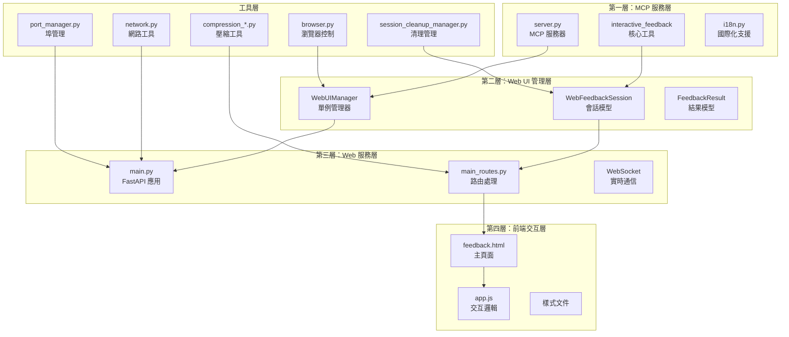
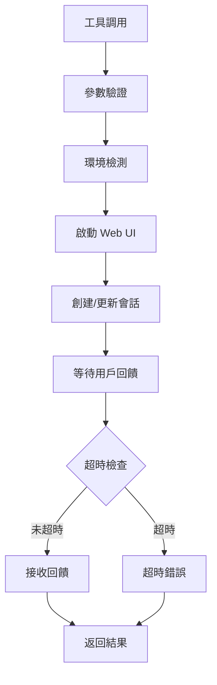
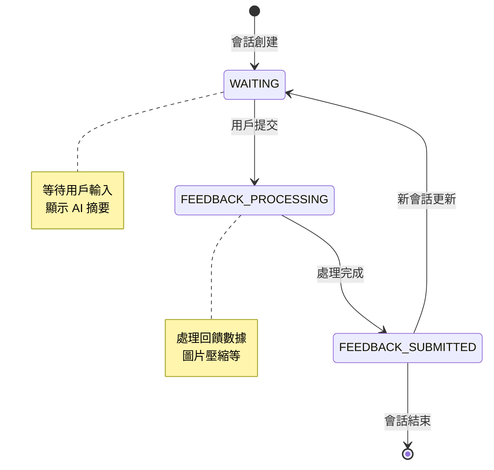
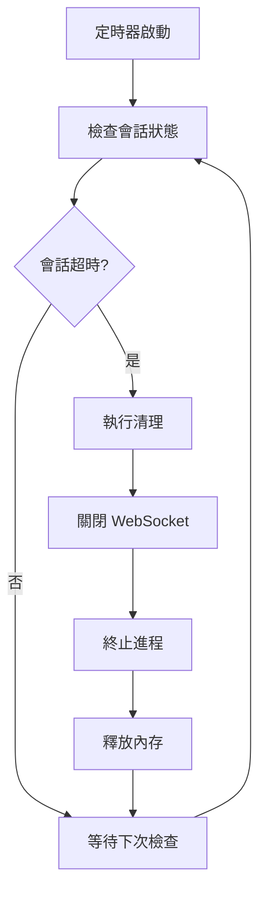

# 組件詳細說明

## 🏗️ 四層架構組件

MCP Feedback Enhanced 採用清晰的四層架構設計，每層負責特定的功能領域。

### 組件關係圖



## 🔧 第一層：MCP 服務層

### server.py - MCP 服務器核心
```python
# 核心功能架構
class MCPServer:
    def __init__(self):
        self.app = FastMCP("mcp-feedback-enhanced")
        self.setup_tools()

    @self.app.tool()
    async def interactive_feedback(
        project_directory: str,
        summary: str,
        timeout: int = 600
    ) -> dict:
        # 環境檢測與驗證
        # Web UI 啟動
        # 會話管理
        # 回饋等待與處理
```

**主要職責**:
- MCP 協議實現和工具註冊
- 環境檢測 (Local/SSH/WSL)
- Web UI 生命週期管理
- 與 AI 助手的接口層

### interactive_feedback 工具


### i18n.py - 國際化支援
- **多語言支援**: 繁體中文、簡體中文、英文
- **動態語言切換**: 基於用戶偏好自動選擇
- **模組化翻譯**: 分離的語言包管理

## 🎛️ 第二層：Web UI 管理層

### WebUIManager - 核心管理器
```python
class WebUIManager:
    def __init__(self):
        self.current_session: Optional[WebFeedbackSession] = None
        self.global_active_tabs: Dict[str, dict] = {}
        self.app: Optional[FastAPI] = None
        self.server_process: Optional[subprocess.Popen] = None
```

**關鍵特性**:
- **單例模式**: 確保全局唯一實例
- **會話生命週期**: 創建、更新、清理會話
- **智能瀏覽器開啟**: 避免重複開啟視窗
- **資源管理**: 自動清理和錯誤處理

### WebFeedbackSession - 會話模型


**狀態管理**:
- `WAITING`: 等待用戶回饋
- `FEEDBACK_PROCESSING`: 處理回饋中
- `FEEDBACK_SUBMITTED`: 回饋已提交

## 🌐 第三層：Web 服務層

### main.py - FastAPI 應用
```python
class FastAPIApp:
    def __init__(self):
        self.app = FastAPI()
        self.setup_middleware()
        self.setup_routes()
        self.setup_websocket()

    def setup_middleware(self):
        # CORS 設定
        # 靜態文件服務
        # 錯誤處理中間件
```

**核心功能**:
- HTTP 路由處理
- WebSocket 連接管理
- 靜態資源服務
- 中間件配置

### main_routes.py - 路由處理
```mermaid
graph LR
    subgraph "HTTP 路由"
        GET[GET /]
        FEEDBACK[GET /feedback]
        STATIC[靜態資源]
    end

    subgraph "WebSocket 路由"
        WS[/ws]
        MSG[訊息處理]
        BROADCAST[廣播機制]
    end

    GET --> FEEDBACK
    FEEDBACK --> STATIC
    WS --> MSG
    MSG --> BROADCAST
```

**WebSocket 訊息類型**:
- `connection_established`: 連接建立
- `session_updated`: 會話更新
- `submit_feedback`: 提交回饋
- `feedback_received`: 回饋確認
- `status_update`: 狀態更新

## 🎨 第四層：前端交互層

### feedback.html - 主頁面
```html
<!-- 核心結構 -->
<div id="app">
    <header><!-- 標題和狀態 --></header>
    <main>
        <section id="ai-summary"><!-- AI 摘要顯示 --></section>
        <section id="feedback-form"><!-- 回饋表單 --></section>
        <section id="image-upload"><!-- 圖片上傳 --></section>
    </main>
    <footer><!-- 狀態指示器 --></footer>
</div>
```

### app.js - 交互邏輯
```javascript
class FeedbackApp {
    constructor() {
        this.websocket = null;
        this.currentSession = null;
        this.feedbackState = 'WAITING';
    }

    // WebSocket 管理
    initWebSocket() { /* ... */ }
    handleWebSocketMessage(data) { /* ... */ }

    // 用戶交互
    submitFeedback() { /* ... */ }
    handleImageUpload() { /* ... */ }

    // UI 更新
    updateSessionDisplay() { /* ... */ }
    updateFeedbackState() { /* ... */ }
}
```

**前端特性**:
- **響應式設計**: 適配不同螢幕尺寸
- **實時狀態同步**: WebSocket 雙向通信
- **圖片上傳**: 拖拽上傳和自動壓縮
- **多語言支援**: 動態語言切換

## 🛠️ 工具層組件

### browser.py - 瀏覽器控制
```python
class BrowserManager:
    @staticmethod
    def open_browser(url: str, environment: str):
        if environment == "local":
            webbrowser.open(url)
        elif environment == "ssh":
            # SSH 隧道處理
        elif environment == "wsl":
            # WSL 特殊處理
```

### port_manager.py - 埠管理
- **動態埠分配**: 自動尋找可用埠
- **埠衝突檢測**: 避免埠佔用問題
- **埠範圍配置**: 可配置的埠範圍

### session_cleanup_manager.py - 清理管理


**清理策略**:
- **超時清理**: 會話超時自動清理
- **資源回收**: WebSocket、進程、內存
- **優雅關閉**: 確保資源正確釋放

---

**下一步**: 查看 [交互流程文檔](./interaction-flows.md) 了解完整的交互機制
