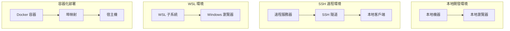
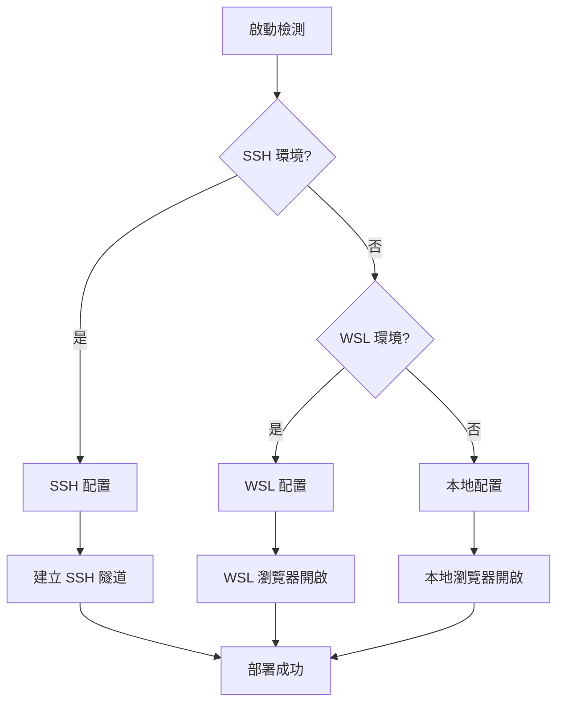

# 部署指南

## 🚀 部署架構概覽

MCP Feedback Enhanced 支援多種部署環境，具備智能環境檢測和自適應配置能力。

### 部署拓撲圖



## 🛠️ 安裝和配置

### 系統要求

#### 最低要求
- **Python**: 3.11 或更高版本
- **內存**: 512MB 可用內存
- **磁盤**: 100MB 可用空間
- **網路**: 可訪問的網路連接

#### 推薦配置
- **Python**: 3.12+
- **內存**: 1GB+ 可用內存
- **磁盤**: 500MB+ 可用空間
- **CPU**: 2 核心或更多

### 安裝方式

#### 1. 使用 uvx（推薦）
```bash
# 直接運行
uvx mcp-feedback-enhanced@latest web

# 指定版本
uvx mcp-feedback-enhanced@2.3.0 web
```

#### 2. 使用 pip
```bash
# 安裝
pip install mcp-feedback-enhanced

# 運行
mcp-feedback-enhanced web
```

#### 3. 從源碼安裝
```bash
# 克隆倉庫
git clone https://github.com/Minidoracat/mcp-feedback-enhanced.git
cd mcp-feedback-enhanced

# 使用 uv 安裝
uv sync

# 運行
uv run python -m mcp_feedback_enhanced web
```

## 🌍 環境配置

### 環境檢測機制



### 1. 本地環境部署

**特點**:
- 直接在本地機器運行
- 自動開啟本地瀏覽器
- 最簡單的部署方式

**配置**:
```bash
# 運行命令
mcp-feedback-enhanced web

# 自動檢測並開啟瀏覽器
# 默認地址: http://localhost:8000
```

### 2. SSH 遠程環境部署

**特點**:
- 在遠程服務器運行服務
- 自動建立 SSH 隧道
- 本地瀏覽器訪問遠程服務

**配置步驟**:

1. **在遠程服務器安裝**:
```bash
# SSH 連接到遠程服務器
ssh user@remote-server

# 安裝服務
pip install mcp-feedback-enhanced
```

2. **運行服務**:
```bash
# 在遠程服務器運行
mcp-feedback-enhanced web --host 0.0.0.0 --port 8000
```

3. **建立 SSH 隧道**（自動或手動）:
```bash
# 手動建立隧道（如果自動檢測失敗）
ssh -L 8000:localhost:8000 user@remote-server
```

### 3. WSL 環境部署

**特點**:
- 在 WSL 子系統中運行
- 自動開啟 Windows 瀏覽器
- 跨系統無縫集成

**配置**:
```bash
# 在 WSL 中運行
mcp-feedback-enhanced web

# 自動檢測 WSL 環境並開啟 Windows 瀏覽器
```

### 4. 容器化部署

#### Docker 部署
```dockerfile
# Dockerfile
FROM python:3.12-slim

WORKDIR /app
COPY . .

RUN pip install mcp-feedback-enhanced

EXPOSE 8000

CMD ["mcp-feedback-enhanced", "web", "--host", "0.0.0.0", "--port", "8000"]
```

```bash
# 構建和運行
docker build -t mcp-feedback-enhanced .
docker run -p 8000:8000 mcp-feedback-enhanced
```

#### Docker Compose
```yaml
# docker-compose.yml
version: '3.8'

services:
  mcp-feedback:
    build: .
    ports:
      - "8000:8000"
    environment:
      - ENVIRONMENT=docker
    volumes:
      - ./projects:/app/projects
    restart: unless-stopped
```

## ⚙️ 配置選項

### 命令行參數

```bash
mcp-feedback-enhanced web [OPTIONS]
```

| 參數 | 類型 | 預設值 | 描述 |
|------|------|--------|------|
| `--host` | `str` | `localhost` | 綁定的主機地址 |
| `--port` | `int` | `8000` | 服務埠號 |
| `--debug` | `bool` | `False` | 啟用調試模式 |
| `--no-browser` | `bool` | `False` | 不自動開啟瀏覽器 |
| `--timeout` | `int` | `600` | 預設會話超時時間（秒） |

### 環境變數

```bash
# 設置環境變數
export MCP_FEEDBACK_HOST=0.0.0.0
export MCP_FEEDBACK_PORT=9000
export MCP_FEEDBACK_DEBUG=true
export MCP_FEEDBACK_TIMEOUT=1200
```

### 配置文件
```json
// config.json
{
    "server": {
        "host": "localhost",
        "port": 8000,
        "debug": false
    },
    "session": {
        "timeout": 600,
        "max_connections": 5
    },
    "ui": {
        "default_language": "zh-TW",
        "theme": "light"
    }
}
```

## 🔧 運維管理

### 服務監控

#### 健康檢查端點
```bash
# 檢查服務狀態
curl http://localhost:8000/health

# 響應示例
{
    "status": "healthy",
    "version": "2.3.0",
    "uptime": "2h 30m 15s",
    "active_sessions": 1
}
```

#### 日誌監控
```python
# 日誌配置
import logging

logging.basicConfig(
    level=logging.INFO,
    format='%(asctime)s - %(name)s - %(levelname)s - %(message)s',
    handlers=[
        logging.FileHandler('mcp-feedback.log'),
        logging.StreamHandler()
    ]
)
```

### 性能調優

#### 內存優化
```python
# 會話清理配置
SESSION_CLEANUP_INTERVAL = 300  # 5分鐘
SESSION_TIMEOUT = 600  # 10分鐘
MAX_CONCURRENT_SESSIONS = 10
```

#### 網路優化
```python
# WebSocket 配置
WEBSOCKET_PING_INTERVAL = 30
WEBSOCKET_PING_TIMEOUT = 10
MAX_WEBSOCKET_CONNECTIONS = 50
```

### 故障排除

#### 常見問題

1. **埠被佔用**
```bash
# 檢查埠使用情況
netstat -tulpn | grep 8000

# 解決方案：使用不同埠
mcp-feedback-enhanced web --port 8001
```

2. **瀏覽器無法開啟**
```bash
# 手動開啟瀏覽器
mcp-feedback-enhanced web --no-browser
# 然後手動訪問 http://localhost:8000
```

3. **SSH 隧道失敗**
```bash
# 手動建立隧道
ssh -L 8000:localhost:8000 user@remote-server

# 或使用不同埠
ssh -L 8001:localhost:8000 user@remote-server
```

#### 調試模式
```bash
# 啟用詳細日誌
mcp-feedback-enhanced web --debug

# 查看詳細錯誤信息
export PYTHONPATH=.
python -m mcp_feedback_enhanced.debug
```

### 安全配置

#### 生產環境安全
```python
# 限制 CORS
app.add_middleware(
    CORSMiddleware,
    allow_origins=["https://yourdomain.com"],
    allow_credentials=True,
    allow_methods=["GET", "POST"],
    allow_headers=["*"],
)

# 添加安全標頭
@app.middleware("http")
async def add_security_headers(request, call_next):
    response = await call_next(request)
    response.headers["X-Content-Type-Options"] = "nosniff"
    response.headers["X-Frame-Options"] = "DENY"
    response.headers["X-XSS-Protection"] = "1; mode=block"
    return response
```

#### 防火牆配置
```bash
# Ubuntu/Debian
sudo ufw allow 8000/tcp

# CentOS/RHEL
sudo firewall-cmd --permanent --add-port=8000/tcp
sudo firewall-cmd --reload
```

## 📊 監控和指標

### 系統指標
- CPU 使用率
- 內存使用量
- 網路連接數
- 活躍會話數

### 業務指標
- 會話創建率
- 回饋提交率
- 平均回應時間
- 錯誤率

### 監控工具集成
```python
# Prometheus 指標
from prometheus_client import Counter, Histogram, Gauge

session_counter = Counter('mcp_sessions_total', 'Total sessions created')
response_time = Histogram('mcp_response_time_seconds', 'Response time')
active_sessions = Gauge('mcp_active_sessions', 'Active sessions')
```

---

**完成**: 架構文檔體系已建立完成，包含完整的技術文檔和部署指南。
