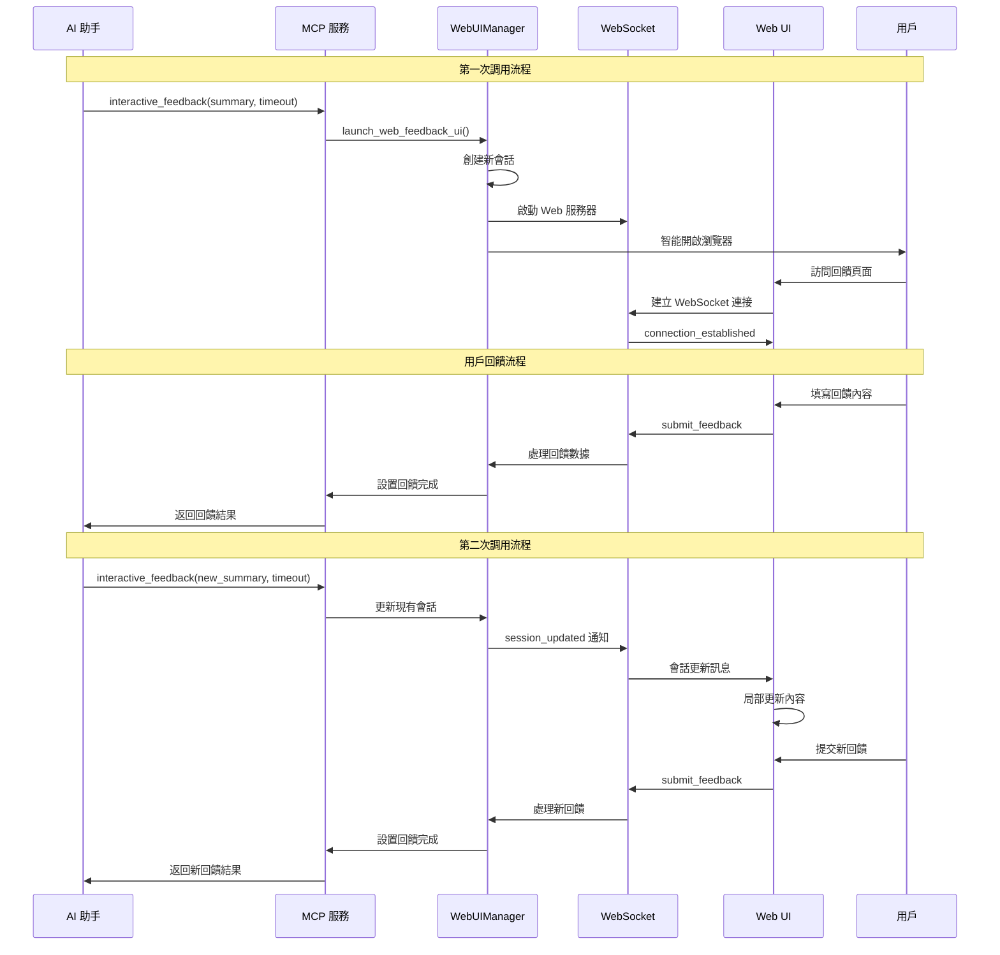
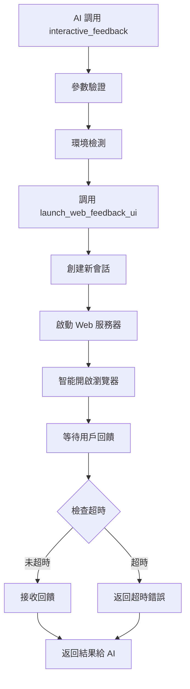
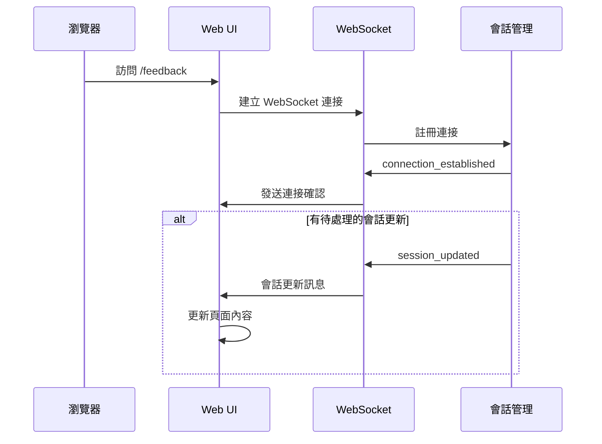
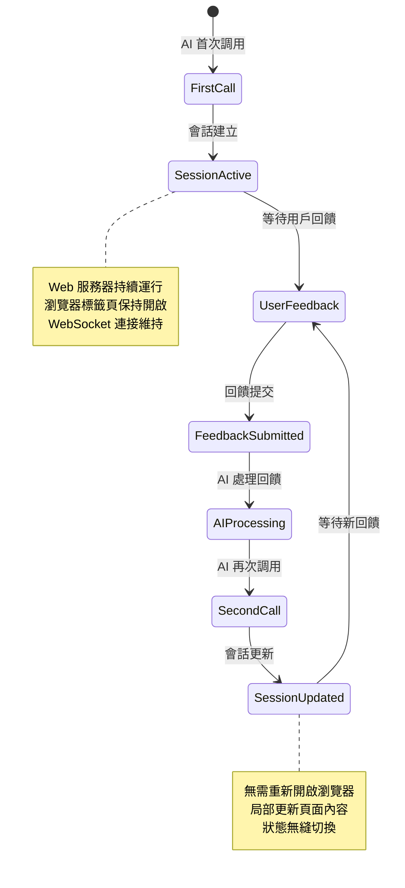
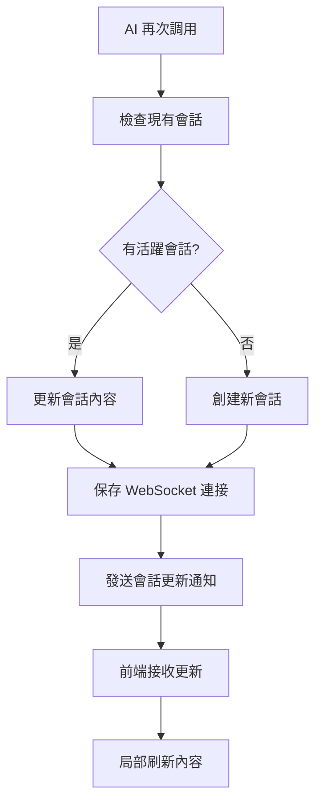
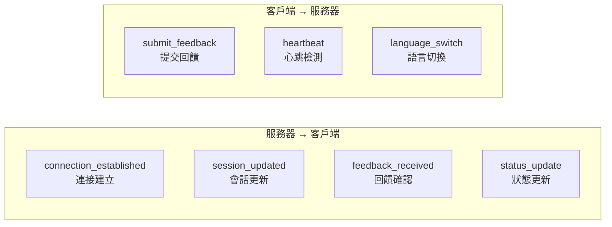
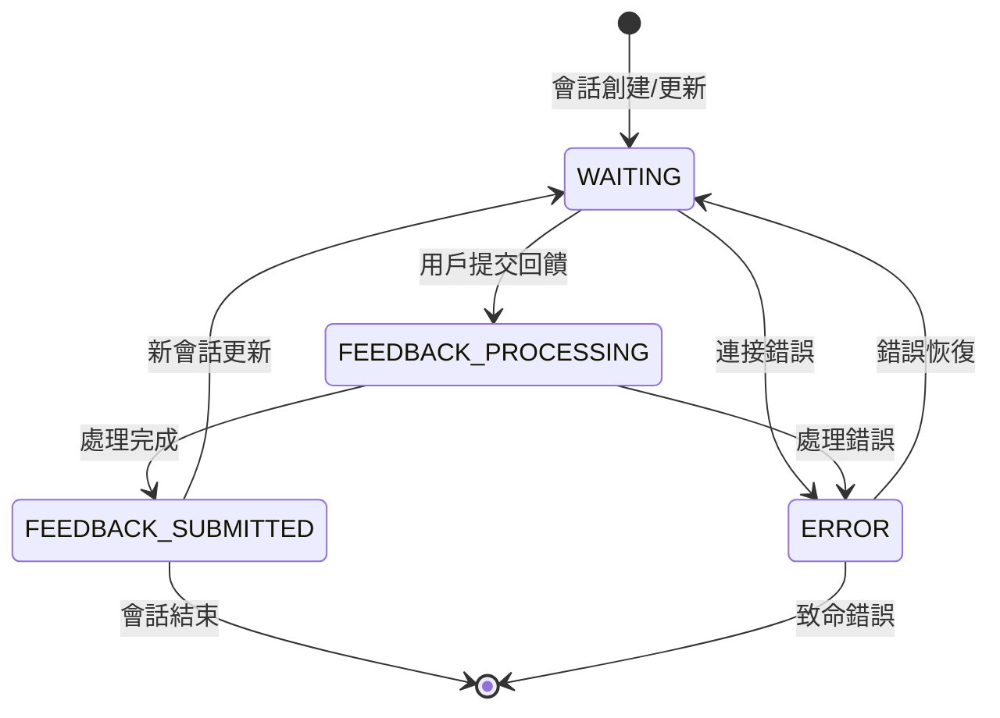

# 交互流程文檔

## 🔄 AI 助手與 MCP 服務完整交互流程

本文檔詳細描述 AI 助手調用 MCP Feedback Enhanced 服務的完整流程，包括首次調用和多次循環調用的機制。

## 📋 流程概覽

### 整體交互時序圖



## 🚀 第一次調用詳細流程

### 1. AI 助手發起調用

```python
# AI 助手調用示例
result = await interactive_feedback(
    project_directory="./my-project",
    summary="我已完成了功能 X 的實現，請檢查代碼品質和邏輯正確性",
    timeout=600
)
```

### 2. MCP 服務處理流程



**關鍵步驟說明**:

#### 2.1 環境檢測
```python
def detect_environment():
    if os.environ.get('SSH_CLIENT') or os.environ.get('SSH_TTY'):
        return "ssh"
    elif 'microsoft' in platform.uname().release.lower():
        return "wsl"
    else:
        return "local"
```

#### 2.2 會話創建
```python
async def create_session(self, summary: str, project_dir: str):
    # 保存舊會話的 WebSocket 連接
    old_websockets = []
    if self.current_session:
        old_websockets = list(self.current_session.websockets)
    
    # 創建新會話
    session_id = str(uuid.uuid4())
    self.current_session = WebFeedbackSession(
        session_id=session_id,
        summary=summary,
        project_directory=project_dir
    )
    
    # 繼承 WebSocket 連接
    for ws in old_websockets:
        self.current_session.add_websocket(ws)
    
    # 標記需要發送會話更新
    self._pending_session_update = True
```

### 3. Web UI 連接建立



## 🔄 多次循環調用機制

### 持久化會話架構

MCP Feedback Enhanced 的核心創新在於**持久化會話架構**，支援 AI 助手進行多次循環調用而無需重新建立連接。



### 第二次調用流程

#### 1. AI 助手再次調用
```python
# AI 根據用戶回饋進行調整後再次調用
result = await interactive_feedback(
    project_directory="./my-project",
    summary="根據您的建議，我已修改了錯誤處理邏輯，請再次確認",
    timeout=600
)
```

#### 2. 智能會話切換


#### 3. 前端無縫更新
```javascript
// 處理會話更新訊息
function handleSessionUpdated(data) {
    // 顯示會話更新通知
    showNotification('會話已更新', 'info');
    
    // 重置回饋狀態
    feedbackState = 'FEEDBACK_WAITING';
    
    // 局部更新 AI 摘要
    updateAISummary(data.summary);
    
    // 清空回饋表單
    clearFeedbackForm();
    
    // 更新會話 ID
    currentSessionId = data.session_id;
    
    // 保持 WebSocket 連接不變
    // 無需重新建立連接
}
```

## 📊 狀態同步機制

### WebSocket 訊息類型



### 狀態轉換圖



## 🛡️ 錯誤處理和恢復

### 連接斷線處理
```javascript
// WebSocket 重連機制
function handleWebSocketClose() {
    console.log('WebSocket 連接已關閉，嘗試重連...');
    
    setTimeout(() => {
        initWebSocket();
    }, 3000); // 3秒後重連
}

// 心跳檢測
setInterval(() => {
    if (websocket && websocket.readyState === WebSocket.OPEN) {
        websocket.send(JSON.stringify({
            type: 'heartbeat',
            timestamp: Date.now()
        }));
    }
}, 30000); // 每30秒發送心跳
```

### 超時處理
```python
async def wait_for_feedback(self, timeout: int = 600):
    try:
        await asyncio.wait_for(
            self.feedback_completed.wait(),
            timeout=timeout
        )
        return self.get_feedback_result()
    except asyncio.TimeoutError:
        raise TimeoutError(f"等待用戶回饋超時 ({timeout}秒)")
```

## 🎯 性能優化

### 連接復用
- **WebSocket 連接保持**: 避免重複建立連接
- **會話狀態繼承**: 新會話繼承舊會話的連接
- **智能瀏覽器開啟**: 檢測活躍標籤頁，避免重複開啟

### 資源管理
- **自動清理機制**: 超時會話自動清理
- **內存優化**: 單一活躍會話模式
- **進程管理**: 優雅的進程啟動和關閉

---

**下一步**: 查看 [API 參考文檔](./api-reference.md) 了解詳細的 API 規範
