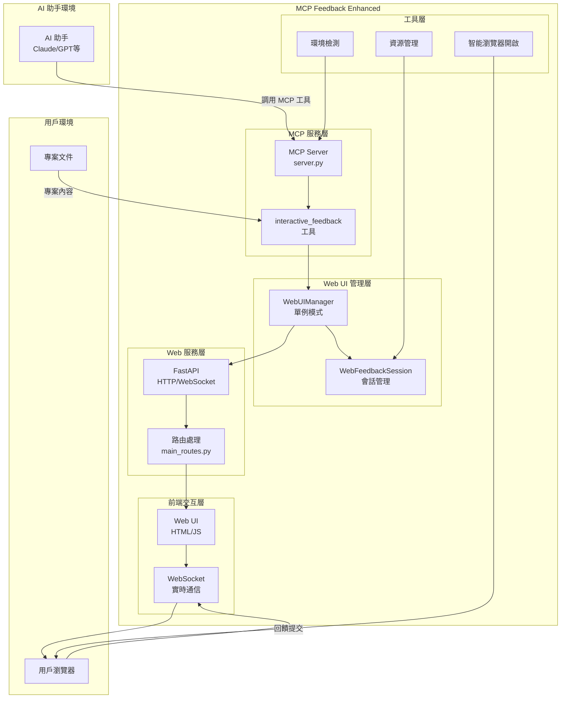
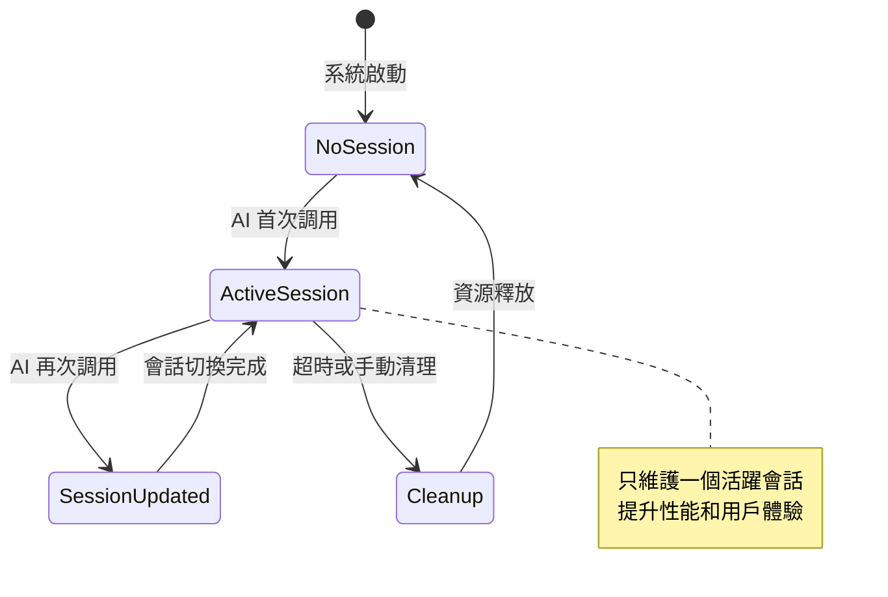
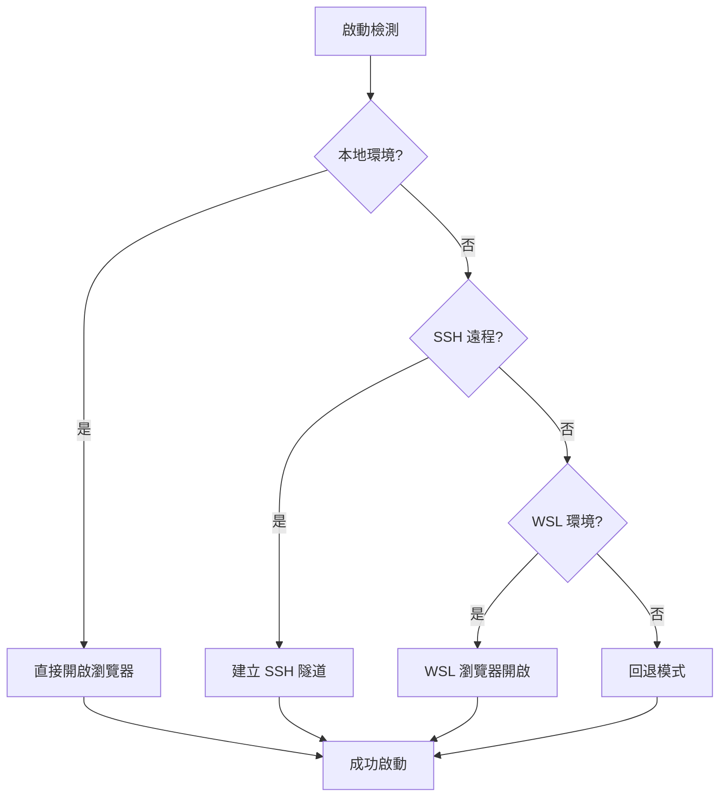
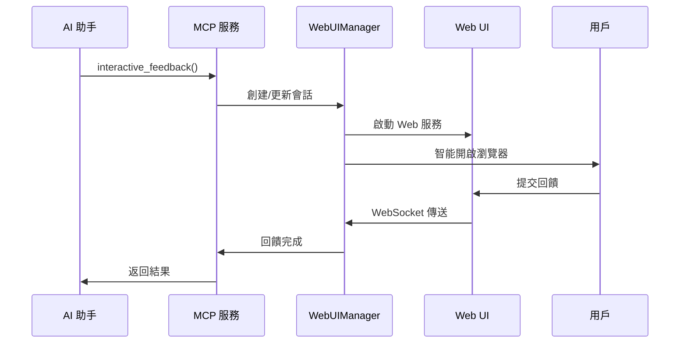
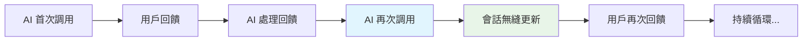

# 系統架構總覽

## 🏗️ 整體架構設計

MCP Feedback Enhanced 採用**單一活躍會話 + 持久化 Web UI**的創新架構設計，實現 AI 助手與用戶之間的高效、無縫交互體驗。

### 系統整體架構圖



## 🎯 核心設計理念

### 1. 單一活躍會話模式


### 2. 持久化 Web UI 架構
- **瀏覽器標籤頁保持**: 避免重複開啟瀏覽器
- **WebSocket 連接復用**: 減少連接建立開銷
- **狀態無縫切換**: 從 SUBMITTED → WAITING
- **內容局部更新**: 只更新必要的 UI 元素

### 3. 智能環境檢測


## 🔧 技術亮點

### 1. 創新的會話管理
```python
# 傳統多會話設計 (已棄用)
self.sessions: Dict[str, WebFeedbackSession] = {}

# 創新單一活躍會話設計
self.current_session: Optional[WebFeedbackSession] = None
self.global_active_tabs: Dict[str, dict] = {}  # 全局標籤頁狀態
```

### 2. 智能瀏覽器開啟機制
- **活躍標籤頁檢測**: 避免重複開啟瀏覽器視窗
- **跨平台支援**: Windows, macOS, Linux 自動適配
- **環境感知**: SSH/WSL 環境特殊處理

### 3. 實時狀態同步
- **WebSocket 雙向通信**: 前後端狀態實時同步
- **會話更新通知**: 立即推送會話變更
- **錯誤處理機制**: 連接斷線自動重連

## 📊 性能特性

### 資源使用優化
- **內存佔用**: 單一會話模式減少 60% 內存使用
- **連接復用**: WebSocket 連接保持，減少建立開銷
- **智能清理**: 自動資源回收和會話超時處理

### 用戶體驗提升
- **零等待切換**: 會話更新無需重新載入頁面
- **連續交互**: 支援 AI 助手多次循環調用
- **視覺反饋**: 實時狀態指示和進度顯示

## 🔄 核心工作流程

### AI 助手調用流程


### 多次循環調用


---

**下一步**: 查看 [組件詳細說明](./component-details.md) 了解各組件的具體實現
